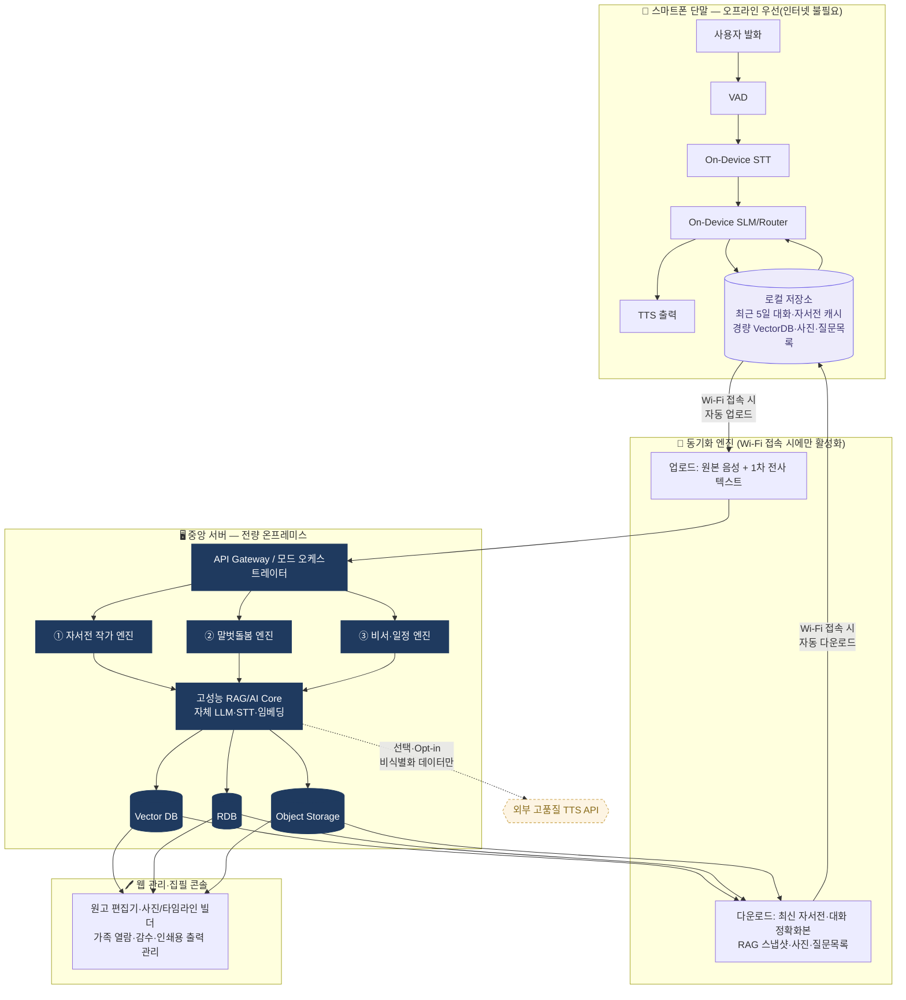
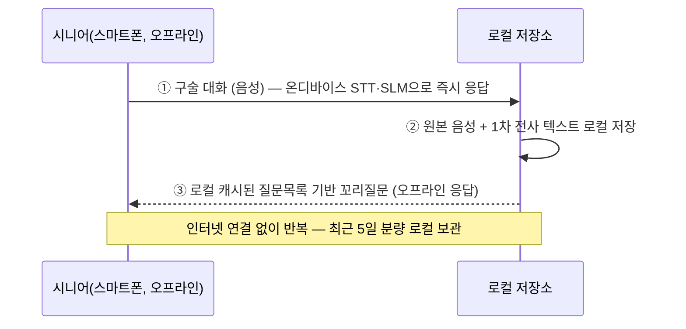
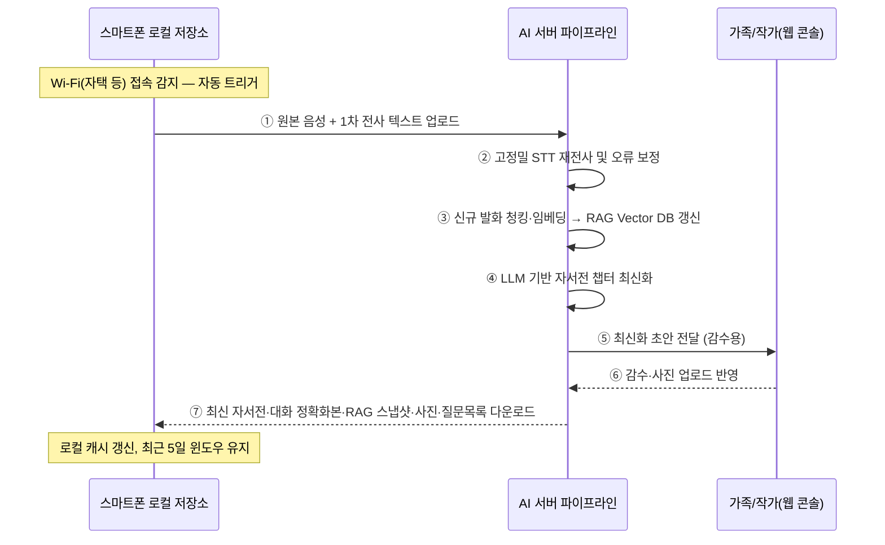
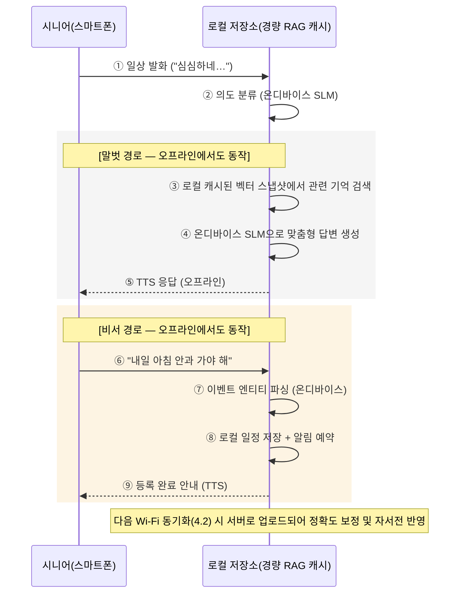
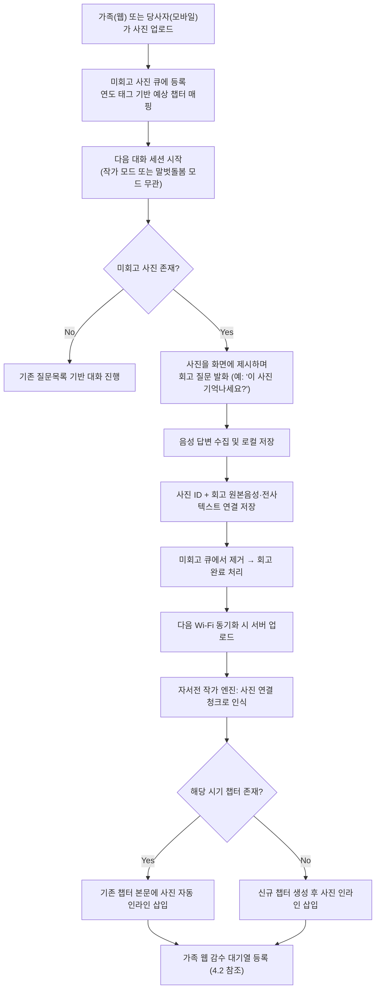

# 어르신 자서전 제작 및 AI 말벗 돌봄서비스 플랫폼

### 온디바이스–클라우드 하이브리드 아키텍처 기반 통합 기획서

**작성:** NUBiz AX(AI Transformation) Initiative
**작성일:** 2026년 9월 (초안 v0.5 — 설치모드 판별 기준 검토자료 부록 추가)

> ※ 본 기획서는 concept.md 초안을 기반으로 작성된 논의용 초안이며, 세부 일정·예산·인력은 추후 확정합니다.

---

## 1. 프로젝트 개요

### 1.1 배경

고령화가 심화되면서 어르신의 삶의 기록이 보존되지 못한 채 소실되는 경우가 많고, 독거 및 정서적 고립으로 인한 돌봄 공백 문제가 커지고 있습니다. 동시에 재활용 스마트폰과 같은 저비용 단말을 활용한 시니어 접근성 개선 요구도 높아지고 있습니다. 다만 재활용·저사양 단말과 고사양 개인 단말은 하드웨어 성능과 사용 맥락이 달라, **단말 사양에 따라 설치 방식을 자동으로 분기하는 구조**가 필요합니다 (3.7절 참조). 특히 시니어 생활 환경상 상시 인터넷 연결을 기대하기 어려운 경우가 많아, **평소 대화는 오프라인으로 완결되고 자택 등에서만 서버와 동기화되는 구조**가 요구됩니다.

### 1.2 목적

스마트폰 온디바이스 음성 인터페이스(VAD·STT·SLM·TTS)와 중앙 서버 기반 생성형 AI 파이프라인(LLM·RAG·VectorDB)을 연계하여, 어르신의 구술 회고를 오프라인 상태에서도 실시간으로 수집·응답하고, Wi-Fi 접속 시 서버의 고성능 엔진으로 자서전과 대화 내용을 최신화·정교화한 뒤 다시 스마트폰으로 동기화하는 구조를 목표로 합니다.

### 1.3 핵심 차별점

- **오프라인 우선(Offline-First)**: 평상시 대화(자서전 구술, 말벗돌봄, 비서 알림)는 인터넷 연결 없이 온디바이스에서 완결
- **Wi-Fi 배치 동기화**: 자택 등 등록된 Wi-Fi 접속 시에만 서버의 고성능 STT·RAG·LLM으로 자서전·대화 내용을 최신화하고 스마트폰으로 재동기화
- 자서전 → 돌봄 데이터 파이프라인 연계: 범용 챗봇과 달리, 사용자 본인의 실제 인생 서사를 근거로 한 초개인화 대화
- **사진 기반 자동 회고 트리거**: 가족 또는 당사자가 올린 신규 사진을 AI가 먼저 제시하며 자연스럽게 회고를 유도하고, 그 사진과 이야기가 그대로 자서전 콘텐츠로 편입
- **디바이스 사양 기반 설치모드 자동 분기**: 저사양·재활용 단말은 키오스크 모드로, 고사양 단말은 일반 앱 모드로 자동 설치되어 동일한 기능을 단말 특성에 맞게 제공
- 작가 모드 → 말벗돌봄 모드 → 비서 모드로 이어지는 3단계 라이프사이클을 단일 플랫폼에서 통합 제공

### 1.4 대상 사용자

| 구분 | 설명 |
|---|---|
| 1차 사용자 | 구술의 주체가 되는 어르신 본인 |
| 2차 사용자 | 자서전을 감수·열람하는 가족, 돌봄 연계가 필요한 요양보호사·복지사 |
| 잠재 고객 | 복지관·요양기관·지자체 등 B2G/B2B 파일럿 운영 주체 (추후 검증 필요) |

---

## 2. 서비스 컨셉 — 3대 운영 모드

사용자의 이용 단계에 따라 세 가지 모드가 순차적으로, 또는 상황에 따라 병행적으로 작동합니다. **세 모드 모두 오프라인 상태에서 온디바이스 자원만으로 기본 동작이 가능**하도록 설계하며, Wi-Fi 동기화 이후 정확도와 개인화 수준이 향상됩니다.

| 모드 | 목표 | 주요 기능 |
|---|---|---|
| ① 자서전 작가 모드 | 연대기적(유년~현재) 구술 발굴 및 문학적 초안 생성 | 질문 생성기(미중복 회고 질문 추출) · **사진 기반 회고 질문**(신규 사진 제시 후 구술 유도) · 심층 인터뷰잉(꼬리질문 유도) · 구술체→문어체 정제 및 챕터 자동 귀속 |
| ② 말벗돌봄 모드 | 완성 자서전 기반 초개인화 공감 대화 및 고독감 해소 | RAG 기반 추억 회상(예: "비가 오네" → 과거 관련 일화 인출) · **사진 기반 회고 대화**(신규 사진을 매개로 한 자연스러운 회상) · 발화 톤·부정어 빈도 분석을 통한 정서 모니터링 및 가족·복지사 알림 연동 |
| ③ 비서 모드 | 인지 기능 보조 및 일상 건강·일정 관리 | 자연어 발화 기반 일정·복약 엔티티 추출 및 DB 등록 · 지정 시각 능동형(Push) 음성 브리핑 |

> ※ 세 모드는 상호 배타적이지 않으며, '의도 분류(Intent Classification)'를 거쳐 하나의 대화 흐름 안에서 자연스럽게 전환됩니다 (4.3 참조). **사진 기반 회고는 작가 모드·말벗돌봄 모드 양쪽에서 공통으로 활용되는 트리거이며, 어느 모드에서 발생하든 회고 내용은 동일하게 자서전 챕터 콘텐츠로 편입됩니다 (4.4 참조).**

---

## 3. 시스템 아키텍처 — 오프라인 우선 하이브리드 구조

본 플랫폼은 **① 평소 오프라인 온디바이스 동작을 기본으로 하고, ② Wi-Fi 접속 시에만 서버와 배치 동기화하며, ③ NUBiz의 온프레미스 데이터 주권 원칙(Zero External Data Egress)을 지키되 일부 비민감 영역에 한해 외부 클라우드 AI를 선택적으로 연계**하는 3중 구조를 채택합니다.

### 3.1 데이터·운영 4원칙

- **원칙 1 (오프라인 우선)**: 평상시 대화(자서전 구술, 말벗돌봄, 비서 알림)는 인터넷 연결 없이 온디바이스에서 완결됩니다. 서버와의 동기화는 등록된 Wi-Fi(예: 자택) 접속 시에만 자동 배치로 수행됩니다.
- **원칙 2 (전면 온프레미스)**: 원본 구술 음성, 자서전 원고, 임베딩 벡터 등 개인식별정보(PII)가 포함된 모든 데이터는 100% NUBiz 자체 GPU 서버(vLLM, A100)와 자체 호스팅 DB에서만 처리·저장합니다.
- **원칙 3 (제한적·선택적 외부 연계)**: 외부 클라우드 AI는 비식별화되고 민감정보가 제거된 데이터에 한해, 사용자/보호자의 명시적 동의(Opt-in) 하에서만 연계합니다.
- **원칙 4 (계약적 통제)**: 외부 연계 범위는 별도 데이터처리계약(DPA) 체결 및 내부 보안 검토를 통과한 항목으로 한정합니다.

### 3.2 온디바이스 오프라인 아키텍처

스마트폰은 평소(인터넷 미연결 상태)에도 아래 로컬 자원만으로 3대 운영 모드를 모두 수행합니다.

| 로컬 구성요소 | 내용 |
|---|---|
| On-Device STT/SLM/TTS | 경량 모델로 즉각 응답하는 오프라인 대화 엔진 |
| 최근 5일 대화 캐시 | 최근 5일간의 원본 음성 + 전사 텍스트를 로컬 보관 |
| 자서전 로컬 캐시 | 최신 동기화 시점 기준 자서전 전체 콘텐츠 사본 |
| 경량 RAG Vector Store | 서버 Vector DB의 서브셋을 로컬용으로 경량화한 스냅샷 (오프라인 회상 대화용) |
| 가족·당사자 업로드 사진 | 웹 콘솔(가족) 또는 온디바이스 카메라·갤러리(당사자)로 추가된 사진의 로컬 캐시 |
| **미회고 사진 큐** | **아직 대화로 다루지 않은 신규 사진 목록 — 작가/말벗돌봄 모드 진입 시 우선 제시 대상** |
| 질문 목록 캐시 | 서버가 정비한 미중복 회고 질문 큐 |

> ※ 오프라인 중에는 로컬 캐시 범위 내에서만 회상·응답이 가능하며, 캐시에 없는 오래된 기억이나 최신 가족 소식은 다음 동기화 이후 반영됩니다. 이는 8.2절의 리스크로도 별도 관리합니다.

### 3.3 온프레미스 서버 처리 영역 (Wi-Fi 동기화 시 활성)

| 영역 | 구성 |
|---|---|
| LLM 추론 | 자체 호스팅 LLM (vLLM · A100 서버) — 자서전 작가 / 말벗돌봄 / 비서 3개 에이전트 전체 처리 |
| STT | 온프레미스 고정밀 STT(자체 호스팅 Whisper 계열)로 온디바이스 1차 전사분 재전사·오류 보정 |
| Vector DB | Qdrant self-hosted — 전체 구술 청크 임베딩(마스터) 저장 및 하이브리드 서치(BM25 + Dense) |
| RDB | PostgreSQL — 사용자, 일정·복약 로그, 편집 원고 이력 |
| Object Storage | 자체 MinIO — 원본 구술 음성 파일(마스터), 완성 PDF/ePub |

### 3.4 제한적 외부 연계 영역 (선택·Opt-in)

아래 항목은 원문 텍스트에서 개인식별정보를 마스킹·비식별화한 뒤, 필요 시에만 선택적으로 외부 API를 연계하는 후보 영역입니다. 기본값은 온프레미스이며, 외부 연계는 사용자가 별도로 동의한 경우에만 활성화됩니다.

- 고품질 감성 TTS: 최종 음성 합성 품질이 중요한 구간에 한해, 비식별화된 원고 텍스트만 외부 TTS(예: ElevenLabs 등)로 전송하는 옵션 — PII 마스킹 전처리 필수, 기본은 자체 파인튜닝 TTS 사용
- 범용 보조 LLM 호출: 개인정보 없는 일반 지식성 질의(예: 공공 정보 안내)에 한해 외부 LLM API를 백업 경로로 검토 (도입 여부는 별도 논의 필요)

> ※ 외부 연계 항목의 구체적 범위, 비용, 계약(DPA) 여부는 보안팀·법무 검토 후 확정이 필요한 사항입니다 (9장 참조).

### 3.5 Wi-Fi 배치 동기화 모델

| 방향 | 항목 | 비고 |
|---|---|---|
| 업로드 (폰 → 서버) | 원본 대화 음성 파일 | 오프라인 기간 누적분 전체 |
| 업로드 (폰 → 서버) | 온디바이스 1차 STT 텍스트 | 서버 재전사로 정밀도 보정 대상 |
| 업로드 (폰 → 서버) | **당사자가 촬영·선택한 신규 사진** | **카메라 촬영 또는 갤러리 선택본, 미회고 큐에 자동 등록** |
| 다운로드 (서버 → 폰) | 최신화된 자서전 콘텐츠 | 신규/수정 챕터 반영본 (사진 인라인 포함) |
| 다운로드 (서버 → 폰) | 최근 5일 대화 정확화본 | 온디바이스 STT 오류를 서버가 재전사로 교정 |
| 다운로드 (서버 → 폰) | RAG 벡터DB 로컬 스냅샷 | 경량화된 서브셋, 오프라인 회상 대화용 |
| 다운로드 (서버 → 폰) | 가족 업로드 사진 · **미회고 사진 큐** | 웹 콘솔에서 추가된 신규 사진 및 **아직 회고 대화로 다루지 않은 사진 목록** |
| 다운로드 (서버 → 폰) | 질문 목록 | 서버가 정비한 미중복 회고 질문 큐 |

- **동기화 트리거**: 등록된 Wi-Fi(자택 등) 접속이 감지되면 사용자 조작 없이 백그라운드에서 자동 수행
- **보관 윈도우 원칙**: 스마트폰에는 "최근 5일" 대화만 상시 로컬 보관하며, 그 이전 데이터는 서버가 마스터로 보관 — 필요 시 온디바이스가 서버에 재요청하여 일시적으로 캐시

### 3.6 시스템 구성도

- 실선(→): 온프레미스 내부 데이터 흐름 및 Wi-Fi 동기화 시 활성 경로
- 점선(⇢): 선택·Opt-in 경로로만 활성화되는 외부 연계 (비식별화 데이터 한정, 3.4 참조)
- 보라색 로컬 저장소: 오프라인 상태에서도 상시 동작하는 온디바이스 캐시 (3.2 참조)

### 3.7 설치모드 자동 분기 — 키오스크 / 일반 앱 (신규)

재활용·저사양 단말과 사용자 개인 소유의 고사양 단말은 사용 맥락이 다릅니다. 재활용 단말은 어르신 전용으로 배포되어 다른 앱 접근으로 인한 혼란을 막을 필요가 있는 반면, 고사양 개인 단말은 이미 다른 앱들과 함께 사용 중이므로 이 앱도 그 중 하나로 자연스럽게 추가되어야 합니다. 이에 따라 **앱 설치 시점에 단말 사양을 자동 체크하여 설치모드를 분기**합니다.

| 구분 | 키오스크 모드 | 일반 앱 모드 |
|---|---|---|
| 대상 단말 | 저사양·재활용 단말 (RAM/OS 버전 등 기준 미달) | 고사양 개인 단말 |
| 설치 방식 | Android Device Owner/Kiosk Mode API로 앱을 단일 실행 상태로 잠금 | 여러 앱 중 하나로 아이콘을 통해 실행하는 일반 설치 |
| 실행 방식 | 부팅 시 자동 실행, 홈 화면·다른 앱 접근 차단 | 사용자가 직접 앱 아이콘 실행, 다른 앱과 자유롭게 전환 |
| 앱 기능(3대 운영 모드 등) | **완전히 동일** — 설치·잠금 방식만 다름 | **완전히 동일** — 설치·잠금 방식만 다름 |
| 모드 결정 시점 | 설치 시 1회 자동 판별 후 고정 (재설치 전까지 유지, 서버 원격 전환 없음) | 좌동 |

- **판별 기준**: RAM 용량, Android OS 버전 등 하드웨어 사양을 설치 시점에 자동 체크하여 임계값 미달 시 키오스크 모드로, 충족 시 일반 앱 모드로 설치합니다. 구체적 임계값(RAM ○○GB 이상 등)은 별도 기술 검토를 거쳐 확정합니다 (9장, 부록 A 참조).
- **서버 역할**: 서버는 기기별 설치모드와 사양 정보를 **조회**할 수 있으나, 원격으로 모드를 전환하거나 잠금을 해제하는 제어 기능은 두지 않습니다. 설치모드는 최초 설치 시 고정되며 재설치 전까지 유지됩니다.
- **데이터 모델**: 기기(Device) 엔티티에 기기ID, 사양 정보(RAM/OS 버전), 설치모드(키오스크/일반), 설치일시 필드를 관리합니다 (5.1절 참조).

---

## 4. 전체 엔드투엔드(End-to-End) 프로세스

### 4.1 오프라인 구술 수집 (상시, 인터넷 불필요)

### 4.2 Wi-Fi 배치 동기화 및 자서전 최신화 (자택 등 접속 시)

### 4.3 일상 운영 단계 — 말벗돌봄 및 비서 (오프라인 우선)

### 4.4 사진 기반 회고 트리거 및 챕터 인라인 편입 (신규)

가족 또는 당사자가 올린 사진은 방치되지 않고, 다음 대화 세션에서 AI가 먼저 제시하며 회고를 유도합니다. 이 대화는 작가 모드·말벗돌봄 모드 어느 쪽에서 시작되든 동일하게 자서전 챕터 콘텐츠로 편입됩니다.

- **트리거 방식**: 가족 웹 업로드, 당사자 모바일 업로드 모두 동일하게 미회고 사진 큐에 등록되며 자동으로 다음 대화에 반영됩니다 (사용자가 별도로 요청하지 않아도 됨).
- **모드 무관성**: 자서전 작가 모드에서는 인터뷰 형식으로, 말벗돌봄 모드에서는 자연스러운 회상 대화 형식으로 진행되지만, 결과물(사진+구술 텍스트)은 동일한 파이프라인으로 챕터에 편입됩니다.
- **편입 방식**: 사진과 회고 텍스트는 별도 섹션이 아닌 **해당 시기 챕터 본문에 자동 인라인 삽입**되며, 이후 웹 콘솔에서 가족이 위치·설명을 조정할 수 있습니다.

---

## 5. 서버 측 세부 모듈 명세

### 5.1 데이터 수집 및 전처리 계층

- 음성 파이프라인: Wi-Fi 동기화 시 업로드된 오디오(WAV/WebM)를 온프레미스 고정밀 STT로 재전사, 어조·억양 메타데이터 보관
- 청킹 및 메타 태깅: 시간대(연령대), 인물(가족관계), 장소, 감정(기쁨·슬픔·도전 등) 메타데이터와 결합해 청크 분할
- **사진 연결 메타데이터**: 사진 기반 회고로 생성된 청크는 연결된 사진 ID를 함께 저장하여, 자서전 작가 엔진이 해당 청크를 챕터에 인라인 삽입할 때 사진을 함께 배치
- **기기(Device) 레지스트리**: 기기ID, 사양 정보(RAM/OS 버전), 설치모드(키오스크/일반), 설치일시를 관리하며, 관리자 조회 목적으로만 사용 (3.7절 참조)

### 5.2 RAG & Vector Engine

- 임베딩 모델: 한국어 문맥 이해도가 높은 다국어 임베딩 모델(예: BGE-M3 계열) 자체 호스팅
- Vector DB: Qdrant self-hosted(마스터), 하이브리드 서치(BM25/Sparse + Dense) 및 시기·인물 기준 메타데이터 필터링
- 온디바이스 배포용 경량화: 마스터 Vector DB에서 사용자 관련성이 높은 서브셋을 추출·경량화하여 동기화 시 스마트폰으로 배포

### 5.3 LLM 오케스트레이션 및 프롬프트 라우터

- 모드 라우터(Router Agent): 사용자 입력 의도를 분류하여 AuthorAgent / CareAgent / ScheduleAgent로 작업 분기 (온디바이스는 경량 라우터, 서버는 정밀 라우터로 이중화)
- 동적 시스템 프롬프트: 자서전 모드는 경청하는 인터뷰어 페르소나, 말벗 모드는 사용자의 일생을 아는 친근한 오랜 벗 페르소나, 비서 모드는 정확한 확인형 비서 페르소나로 각각 구성

---

## 6. 보안 및 데이터 거버넌스

- 개인정보 보호: 가족사·경제사정·건강 등 극도의 민감 정보를 포함하므로 DB 암호화(AES-256) 및 전송구간 암호화(TLS 1.3) 적용 — 온디바이스 로컬 캐시도 동일 수준으로 암호화
- 접근 제어: 웹 콘솔 접근 시 2단계 인증(2FA), 시니어 본인 외 열람자는 역할별 차등 권한 부여
- 외부 연계 통제: 3.4절의 외부 API 연계 항목은 PII 마스킹 전처리와 사용자 동의 로그를 필수로 남기며, 미동의 시 전량 온프레미스 경로로만 처리
- 동기화 보안: Wi-Fi 동기화는 등록된 신뢰 네트워크에서만 수행하며, 전송 구간은 TLS 1.3으로 암호화 — 동기화 실패·중단 시 재시도 및 무결성 검증(체크섬) 적용
- 백업 및 출력: 자서전 데이터는 JSON·마크다운으로 상시 백업, 최종 인쇄용 하드커버 PDF(CMYK 300DPI) 자동 조판 파이프라인 연계

---

## 7. 단계별 개발 로드맵 (제안 초안)

> ※ 아래 일정·범위는 팀 논의 전 제안 수준의 초안이며, 실제 착수 전 리소스·예산 확정이 필요합니다.

| 단계 | 범위 | 핵심 목표 |
|---|---|---|
| Phase 1 (MVP) | 자서전 작가 모드 + 오프라인 코어 | 온디바이스 STT/SLM/TTS 오프라인 대화, 로컬 캐시(3.2) 및 Wi-Fi 배치 동기화(3.5) 기본 흐름 검증 |
| Phase 2 | 말벗돌봄 모드 확장 | 로컬 경량 RAG 스냅샷 기반 오프라인 회상 대화, 정서 모니터링 및 알림 연동 고도화 |
| Phase 3 | 비서 모드 + 외부 연계 옵션 | 오프라인 일정·복약 비서 기능 통합, 선택적 외부 TTS 연계(3.4) 파일럿, B2G 확장 검토 |

---

## 8. 기대효과 및 리스크

### 8.1 기대효과

- 인터넷 환경이 불안정한 시니어 생활 환경에서도 끊김 없는 대화 경험 제공
- 어르신 삶의 기록이 유실되지 않고 자산화되어 가족 간 세대 연결에 기여
- 자서전 데이터 기반 초개인화 대화로 범용 챗봇 대비 높은 정서적 몰입도 제공
- 자서전 제작(입구) → 돌봄·비서(체류)로 이어지는 자연스러운 사용자 여정으로 락인(lock-in) 효과 기대

### 8.2 주요 리스크

- 민감정보 처리 리스크: 가족사·건강 등 초민감 데이터 특성상 정보 유출 시 파급력이 큼 → 하이브리드 원칙(3.1) 준수 및 정기 보안 감사 필요
- 온디바이스 SLM 성능 한계: 저사양 재활용 단말 환경에서 STT/SLM 응답 품질·지연 이슈 가능 → 온디바이스/서버 역할 분담 및 모델 경량화 튜닝 필요
- 오프라인 캐시 정합성 리스크: 로컬 저장 용량 제약 및 장기간 Wi-Fi 미접속 시 자서전·질문목록 최신화 지연 가능 → 캐시 용량 관리 정책 및 동기화 실패 재시도 로직 필요
- 정서 모니터링의 오탐 리스크: 우울 징후 오판정 시 불필요한 가족·복지사 알림 발생 가능 → 임계치 및 검증 프로세스 별도 설계 필요

---

## 9. 다음 논의가 필요한 사항

- '기억의 서재' 프로젝트와는 별개 신규 기획으로 확정 — 향후 온디바이스 SLM 모델 선정(Kanana-2 등) 및 브랜드 포지셔닝 중복 여부 재점검 필요
- Wi-Fi 동기화 트리거 정책 확정: 등록 Wi-Fi(자택) 한정 여부, 데이터 사용량 제한, 동기화 주기(접속 즉시 vs 특정 시간대) 등
- 로컬 보관 "최근 5일" 기준의 적정성 — 단말 저장 용량, 자서전 캐시 크기와의 트레이드오프 검토 필요
- 3.4절 외부 TTS 연계의 구체 대상 서비스, 비용, DPA 체결 여부 — 법무·보안팀 검토 필요
- 타겟 채널: B2C(가족 결제) vs B2G(지자체·복지관 파일럿) 우선순위 결정
- Phase 1~3 착수 일정, 예산, 투입 인력 규모 확정
- 정서 모니터링 알림의 법적/윤리적 기준(누구에게, 어떤 임계치로 통보할지) 수립
- **당사자의 모바일 사진 업로드 UX 확정**: 카메라 즉시 촬영 vs 기존 갤러리에서 선택, 저사양 단말의 저장 용량·이미지 압축 정책
- **사진 인라인 편입 정책 확정**: 챕터 본문 자동 삽입 후 가족이 위치를 재조정할 수 있는 범위, 부적절하거나 흐릿한 사진에 대한 필터링 기준
- **키오스크/일반 모드 판별 임계값 확정**: RAM·OS 버전 등 구체적 사양 기준값 결정 필요 (부록 A 검토자료 참조)
- **키오스크 모드 구현 방식 기술 검토**: Android Device Owner Mode vs Screen Pinning 등 구현 옵션 비교 필요

---

## 부록 A. 설치모드 판별 기준 검토자료 (참고용 — 미확정)

> ※ 본 부록은 3.7절 설치모드 자동 분기의 구체적 임계값을 정하기 위해 조사한 참고자료입니다. 아직 확정된 사양 기준이 아니며, 별도 기술 검토를 거쳐 최종 확정합니다 (9장 참조).

### A.1 판별 기준 설계 원칙 — 온디바이스 AI 구동 요건

온디바이스 SLM(1~3B급, 4bit 양자화 기준)이 STT·TTS와 동시에 원활히 구동되려면 다음 하드웨어 조건이 뒷받침되어야 합니다.

- 안드로이드 앱은 시스템 전체 RAM의 약 40~50%만 사용 가능
- 2B급 모델은 최소 4GB RAM 기기 권장 — SLM 단독 기준이며, STT·TTS 동시 구동 시 여유 RAM 필요
- 7B급 모델은 최소 8GB RAM 권장 (참고용 — 본 프로젝트는 1~3B급 경량 SLM 사용 예정)
- 위 여유분을 감안하면 **총 RAM 6GB 이상**이 실질적인 최소 마지노선으로 판단됨

RAM만으로는 판별이 불충분한 이유도 확인되었습니다. 예를 들어 갤럭시 S10/노트10 시리즈는 RAM 8GB 이상으로 사양상 충분하지만, 2023년에 이미 OS·보안 업데이트가 종료되었습니다. 어르신의 구술 음성·자서전 등 극민감 개인정보를 다루는 만큼, 보안 패치가 끊긴 단말은 사양과 무관하게 위험 요소로 판단해야 합니다. 따라서 **RAM과 Android OS 버전(보안지원 현황) 두 축을 함께 보는 판별 로직**을 제안합니다.

### A.2 제안 임계값 (검토안)

| 기준 | 값 | 근거 |
|---|---|---|
| RAM | 6GB 미만 → 키오스크 모드 | 2B급 SLM + STT + TTS 동시 구동 최소선 |
| Android 버전 | 11(API 30) 이하 → 키오스크 모드 | 주요 구형 모델의 보안 업데이트 종료 시점과 대체로 일치 |
| 판정 로직 | RAM·OS 조건 중 **하나라도 미달 시** 키오스크 모드로 분류 | 민감정보를 다루는 서비스 특성상 보수적(안전 우선) 판정 |

### A.3 실제 갤럭시 모델 매핑 (예시)

| 구분 | 대표 모델 | RAM | 비고 |
|---|---|---|---|
| 키오스크 대상 (저사양·재활용) | 갤럭시 S9 / S9+, 노트9 (2018) | 4~8GB | Android 10 최종 버전, 보안지원 2022년 종료 |
| 키오스크 대상 (저사양·재활용) | 갤럭시 S10 / S10e / 노트10 (2019) | 6~12GB | RAM은 충족하나 OS·보안지원 2023년 종료로 키오스크 판정 |
| 키오스크 대상 (저사양·재활용) | 갤럭시 A10~A30 구형, J시리즈 | 2~4GB | RAM 기준 자체 미달 |
| 일반 앱 대상 (고사양) | 갤럭시 A35 / A55 / A56 (2024~2025) | 6~12GB | Android 14, One UI 6회 업데이트 지원 정책 |
| 일반 앱 대상 (고사양) | 갤럭시 S23 / S24 / S25 시리즈 | 8~12GB | 최신 플래그십, 충분한 여유 RAM |

### A.4 경계 사례 및 유의사항

- **RAM 충분·OS 지원 종료 사례** (예: S10+, 노트10+)가 재활용 단말 중 가장 흔할 것으로 예상됩니다. RAM 단일 기준만으로 판별하면 이런 기기가 잘못 "일반 앱 모드"로 분류될 위험이 있어, OS 버전 조건을 반드시 함께 적용해야 합니다.
- AP/NPU 유무(AI TOPS)도 보조 지표로 활용 가능합니다 — 예: 갤럭시 A25(4.3 TOPS), A35(4.9 TOPS), A56(14.7 TOPS)처럼 최근 중저가 모델도 NPU 가속을 지원하는 경우가 늘고 있어, 향후 임계값 재조정 시 참고할 수 있습니다.
- 위 수치는 조사 시점 기준 참고자료이며, 실제 온디바이스 SLM 모델 확정(9장 참조) 이후 벤치마크 테스트를 통해 최종 임계값을 검증해야 합니다.

---

*— 이하 여백 —*
