# 어르신 자서전·말벗돌봄 플랫폼 — 업무/프로세스 흐름도 상세

### 자서전 웹(서버 LLM·RAG) · 모바일앱(온디바이스 STT/VAD/SLM/RAG) · 서버 모듈 · 분야별 업무 흐름

**작성:** NUBiz AX(AI Transformation) Initiative · **작성일:** 2026년 9월

> 본 문서는 `어르신_자서전_말벗돌봄_기획서.md`(기획서 v0.5)의 3~5장 아키텍처를 기술/업무 단위로 세분화한 프로세스 흐름도 모음입니다. 각 다이어그램은 Mermaid로 작성되어 GitHub·VS Code·Obsidian 등에서 바로 렌더링됩니다.

## 목차

0. [범례 및 표기 규칙](#0-범례-및-표기-규칙)
1. [전체 통합 흐름도 (마스터)](#1-전체-통합-흐름도-마스터)
2. [자서전 웹 — 서버 LLM·RAG 자원 활용 흐름](#2-자서전-웹--서버-llmrag-자원-활용-흐름)
3. [모바일앱 — 온디바이스 STT/VAD/SLM/RAG 흐름](#3-모바일앱--온디바이스-sttvadslmrag-흐름)
4. [서버측 모듈 흐름](#4-서버측-모듈-흐름)
5. [분야별 업무 프로세스 흐름도](#5-분야별-업무-프로세스-흐름도)

---

## 0. 범례 및 표기 규칙

| 표기 | 의미 |
|---|---|
| `flowchart` | 조건 분기가 있는 로직/업무 흐름 |
| `sequenceDiagram` | 주체(사용자·단말·서버·가족) 간 시간순 상호작용 |
| `stateDiagram-v2` | 단말·세션의 상태 전이 (Idle/Listening/Syncing 등) |
| 남색 노드 | 서버(온프레미스) 처리 |
| 보라색 노드 | 온디바이스(모바일) 처리 |
| 크림색/점선 | 선택·Opt-in 외부 연계 |

---

## 1. 전체 통합 흐름도 (마스터)

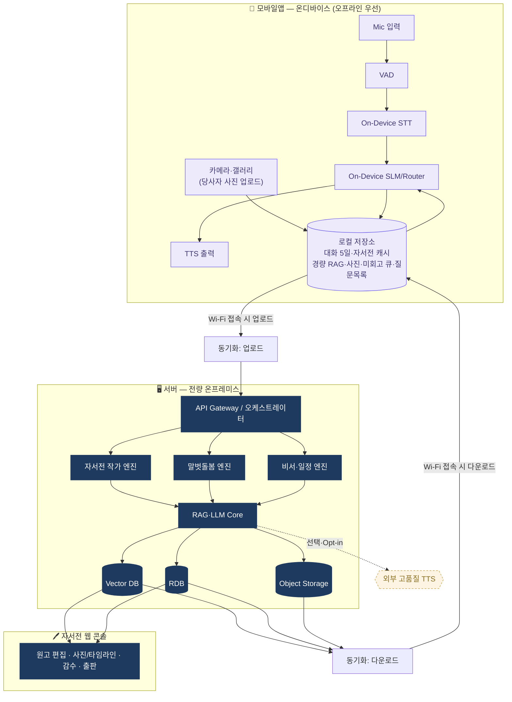
```mermaid
flowchart TB
    subgraph MOBILE["📱 모바일앱 — 온디바이스 (오프라인 우선)"]
        MIC["Mic 입력"] --> VAD["VAD"] --> STTD["On-Device STT"] --> SLM["On-Device SLM/Router"] --> TTSD["TTS 출력"]
        CAM["카메라·갤러리<br/>(당사자 사진 업로드)"] --> LOCAL
        SLM --> LOCAL[("로컬 저장소<br/>대화 5일·자서전 캐시<br/>경량 RAG·사진·미회고 큐·질문목록")]
        LOCAL --> SLM
    end

    LOCAL -->|"Wi-Fi 접속 시 업로드"| SYNCUP["동기화: 업로드"]
    SYNCDOWN["동기화: 다운로드"] -->|"Wi-Fi 접속 시 다운로드"| LOCAL

    SYNCUP --> GW

    subgraph SERVER["🖥️ 서버 — 전량 온프레미스"]
        GW["API Gateway / 오케스트레이터"]
        GW --> E1["자서전 작가 엔진"]
        GW --> E2["말벗돌봄 엔진"]
        GW --> E3["비서·일정 엔진"]
        E1 --> RAG["RAG·LLM Core"]
        E2 --> RAG
        E3 --> RAG
        RAG --> VDB[("Vector DB")]
        RAG --> RDB[("RDB")]
        RAG --> OBJ[("Object Storage")]
    end

    VDB --> SYNCDOWN
    RDB --> SYNCDOWN
    OBJ --> SYNCDOWN
    VDB --> WEB
    RDB --> WEB

    RAG -.->|"선택·Opt-in"| EXT{{"외부 고품질 TTS"}}

    subgraph WEBCONSOLE["🖊️ 자서전 웹 콘솔"]
        WEB["원고 편집 · 사진/타임라인 · 감수 · 출판"]
    end

    classDef onprem fill:#1F3A5F,color:#ffffff,stroke:#1F3A5F;
    classDef device fill:#EDEBFB,color:#3E3771,stroke:#6C5CE7;
    classDef opt fill:#FDF4E3,color:#8A6D1D,stroke:#C9A24B,stroke-dasharray: 4 3;
    class GW,E1,E2,E3,RAG,VDB,RDB,OBJ,WEB onprem;
    class MIC,VAD,STTD,SLM,TTSD,LOCAL,CAM device;
    class EXT opt;
```

---

## 2. 자서전 웹 — 서버 LLM·RAG 자원 활용 흐름

### 2.1 자서전 작가 엔진 상세 흐름

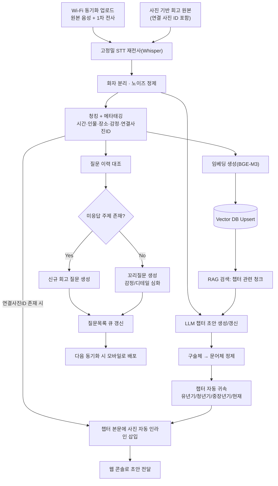
```mermaid
flowchart TD
    A["Wi-Fi 동기화 업로드<br/>원본 음성 + 1차 전사"] --> B["고정밀 STT 재전사(Whisper)"]
    PH["사진 기반 회고 원본<br/>(연결 사진 ID 포함)"] --> B
    B --> C["화자 분리 · 노이즈 정제"]
    C --> D["청킹 + 메타태깅<br/>시간·인물·장소·감정·연결사진ID"]
    D --> E["임베딩 생성(BGE-M3)"]
    E --> F[("Vector DB Upsert")]
    D --> G["질문 이력 대조"]
    G --> H{"미응답 주제 존재?"}
    H -- "Yes" --> I["신규 회고 질문 생성"]
    H -- "No" --> J["꼬리질문 생성<br/>감정/디테일 심화"]
    I --> K["질문목록 큐 갱신"]
    J --> K
    F --> L["RAG 검색: 챕터 관련 청크"]
    C --> M["LLM 챕터 초안 생성/갱신"]
    L --> M
    M --> N["구술체 → 문어체 정제"]
    N --> O["챕터 자동 귀속<br/>유년기/청년기/중장년기/현재"]
    D -- "연결사진ID 존재 시" --> O2["챕터 본문에 사진 자동 인라인 삽입"]
    O --> O2
    O2 --> P["웹 콘솔로 초안 전달"]
    K --> Q["다음 동기화 시 모바일로 배포"]
```

> ※ 사진 기반 회고(2.5절)로 생성된 청크는 일반 구술 청크와 동일한 파이프라인을 거치되, 연결된 사진 ID를 함께 저장하여 챕터 생성 단계에서 본문에 사진이 자동 인라인 삽입됩니다.

### 2.2 RAG 인덱싱 · 검색 파이프라인

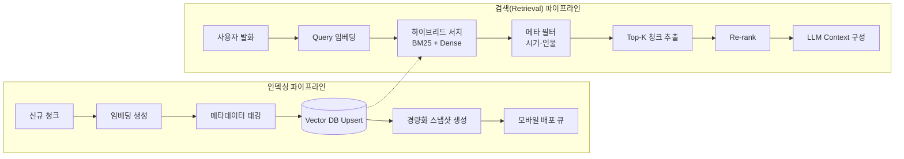
```mermaid
flowchart LR
    subgraph INDEX["인덱싱 파이프라인"]
        I1["신규 청크"] --> I2["임베딩 생성"]
        I2 --> I3["메타데이터 태깅"]
        I3 --> I4[("Vector DB Upsert")]
        I4 --> I5["경량화 스냅샷 생성"]
        I5 --> I6["모바일 배포 큐"]
    end

    subgraph RETRIEVE["검색(Retrieval) 파이프라인"]
        R1["사용자 발화"] --> R2["Query 임베딩"]
        R2 --> R3["하이브리드 서치<br/>BM25 + Dense"]
        R3 --> R4["메타 필터<br/>시기·인물"]
        R4 --> R5["Top-K 청크 추출"]
        R5 --> R6["Re-rank"]
        R6 --> R7["LLM Context 구성"]
    end

    I4 -.-> R3
```

### 2.3 LLM 오케스트레이션 라우팅 (서버)

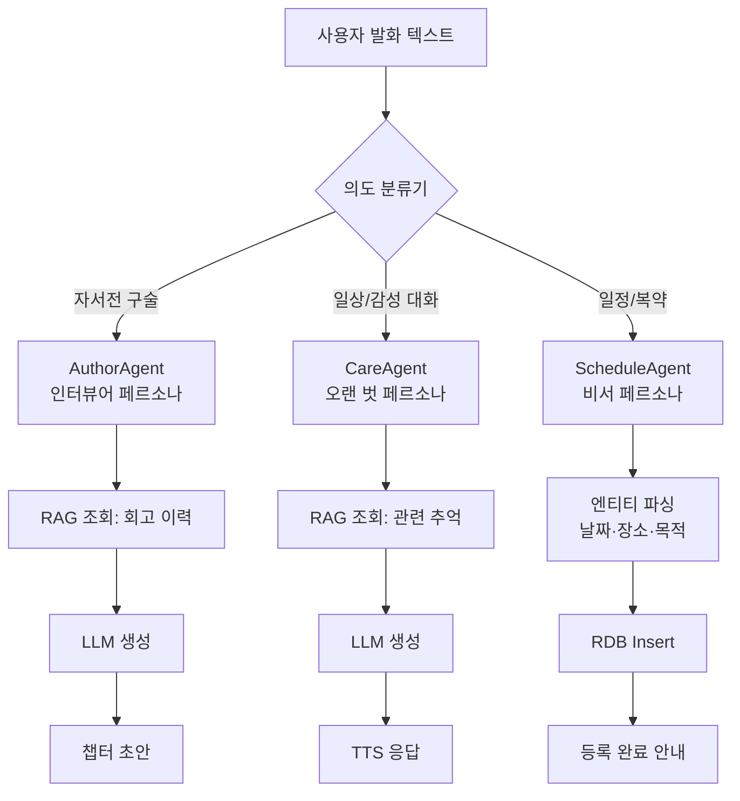
```mermaid
flowchart TD
    Input["사용자 발화 텍스트"] --> Router{"의도 분류기"}
    Router -- "자서전 구술" --> Author["AuthorAgent<br/>인터뷰어 페르소나"]
    Router -- "일상/감성 대화" --> Care["CareAgent<br/>오랜 벗 페르소나"]
    Router -- "일정/복약" --> Sched["ScheduleAgent<br/>비서 페르소나"]

    Author --> RQ1["RAG 조회: 회고 이력"]
    Care --> RQ2["RAG 조회: 관련 추억"]
    Sched --> Parse["엔티티 파싱<br/>날짜·장소·목적"]

    RQ1 --> LLM1["LLM 생성"]
    RQ2 --> LLM2["LLM 생성"]
    Parse --> Insert["RDB Insert"]

    LLM1 --> Out1["챕터 초안"]
    LLM2 --> Out2["TTS 응답"]
    Insert --> Out3["등록 완료 안내"]
```

### 2.4 웹 콘솔 감수 · 출판 워크플로우

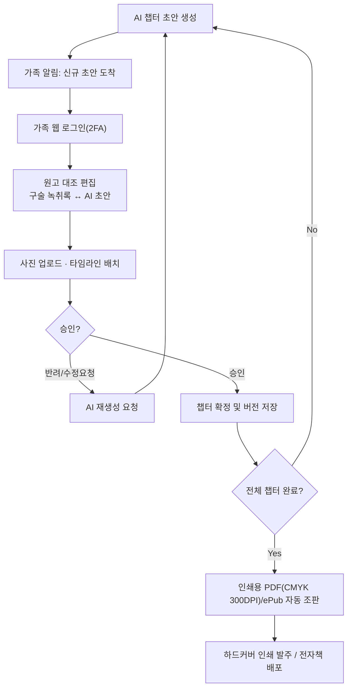
```mermaid
flowchart TD
    Draft["AI 챕터 초안 생성"] --> Notify["가족 알림: 신규 초안 도착"]
    Notify --> Login["가족 웹 로그인(2FA)"]
    Login --> Compare["원고 대조 편집<br/>구술 녹취록 ↔ AI 초안"]
    Compare --> Photo["사진 업로드 · 타임라인 배치"]
    Photo --> Decision{"승인?"}
    Decision -- "반려/수정요청" --> Regen["AI 재생성 요청"]
    Regen --> Draft
    Decision -- "승인" --> Confirm["챕터 확정 및 버전 저장"]
    Confirm --> AllDone{"전체 챕터 완료?"}
    AllDone -- "No" --> Draft
    AllDone -- "Yes" --> Publish["인쇄용 PDF(CMYK 300DPI)/ePub 자동 조판"]
    Publish --> Print["하드커버 인쇄 발주 / 전자책 배포"]
```

### 2.5 사진 기반 회고 → 챕터 인라인 편입 파이프라인 (신규)

가족 또는 당사자가 올린 사진이 대화의 소재가 되고, 그 결과물이 자서전 챕터에 자동으로 편입되는 전체 파이프라인입니다. 작가 모드·말벗돌봄 모드 어느 쪽에서 트리거되든 동일한 경로를 거칩니다.

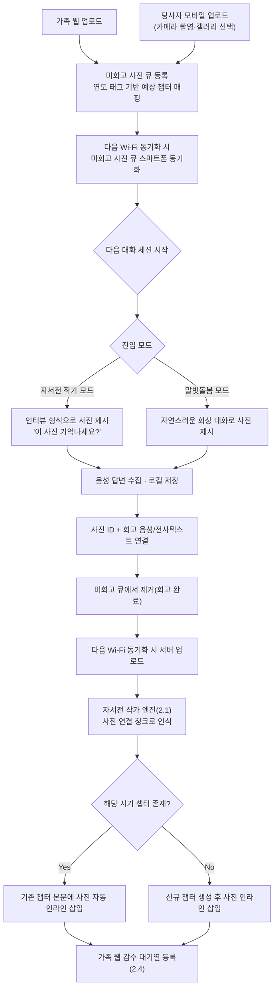
```mermaid
flowchart TD
    U1["가족 웹 업로드"] --> Q["미회고 사진 큐 등록<br/>연도 태그 기반 예상 챕터 매핑"]
    U2["당사자 모바일 업로드<br/>(카메라 촬영·갤러리 선택)"] --> Q
    Q --> Sync["다음 Wi-Fi 동기화 시<br/>미회고 사진 큐 스마트폰 동기화"]
    Sync --> Session{"다음 대화 세션 시작"}
    Session --> Mode{"진입 모드"}
    Mode -- "자서전 작가 모드" --> Author["인터뷰 형식으로 사진 제시<br/>'이 사진 기억나세요?'"]
    Mode -- "말벗돌봄 모드" --> Care["자연스러운 회상 대화로 사진 제시"]
    Author --> Answer["음성 답변 수집 · 로컬 저장"]
    Care --> Answer
    Answer --> Link["사진 ID + 회고 음성/전사텍스트 연결"]
    Link --> Done["미회고 큐에서 제거(회고 완료)"]
    Done --> Upload["다음 Wi-Fi 동기화 시 서버 업로드"]
    Upload --> Engine["자서전 작가 엔진(2.1)<br/>사진 연결 청크로 인식"]
    Engine --> Exist{"해당 시기 챕터 존재?"}
    Exist -- "Yes" --> Update["기존 챕터 본문에 사진 자동 인라인 삽입"]
    Exist -- "No" --> New["신규 챕터 생성 후 사진 인라인 삽입"]
    Update --> Review["가족 웹 감수 대기열 등록(2.4)"]
    New --> Review
```

- **공통 트리거**: 업로더가 가족이든 당사자든 동일하게 미회고 사진 큐에 등록되어 별도 요청 없이 자동으로 다음 대화에 반영됩니다.
- **모드 무관 결과 일치**: 작가 모드의 인터뷰형 진행과 말벗돌봄 모드의 자연스러운 회상형 진행은 사용자 경험만 다를 뿐, 결과 데이터(사진+구술 텍스트)는 동일하게 자서전 작가 엔진으로 유입됩니다.
- **편입 원칙**: 별도 "사진 섹션"이 아닌 **해당 시기 챕터 본문에 자동 인라인 삽입**되며, 가족이 웹 콘솔(2.4)에서 위치·설명을 조정할 수 있습니다.

---

## 3. 모바일앱 — 온디바이스 STT/VAD/SLM/RAG 흐름

### 3.1 온디바이스 음성 파이프라인 상태 흐름

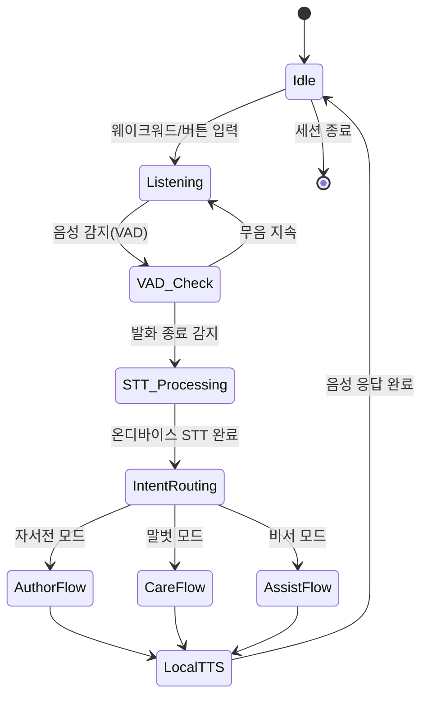
```mermaid
stateDiagram-v2
    [*] --> Idle
    Idle --> Listening: 웨이크워드/버튼 입력
    Listening --> VAD_Check: 음성 감지(VAD)
    VAD_Check --> Listening: 무음 지속
    VAD_Check --> STT_Processing: 발화 종료 감지
    STT_Processing --> IntentRouting: 온디바이스 STT 완료
    IntentRouting --> AuthorFlow: 자서전 모드
    IntentRouting --> CareFlow: 말벗 모드
    IntentRouting --> AssistFlow: 비서 모드
    AuthorFlow --> LocalTTS
    CareFlow --> LocalTTS
    AssistFlow --> LocalTTS
    LocalTTS --> Idle: 음성 응답 완료
    Idle --> [*]: 세션 종료
```

### 3.2 온디바이스 의도분류 · 모드 라우팅

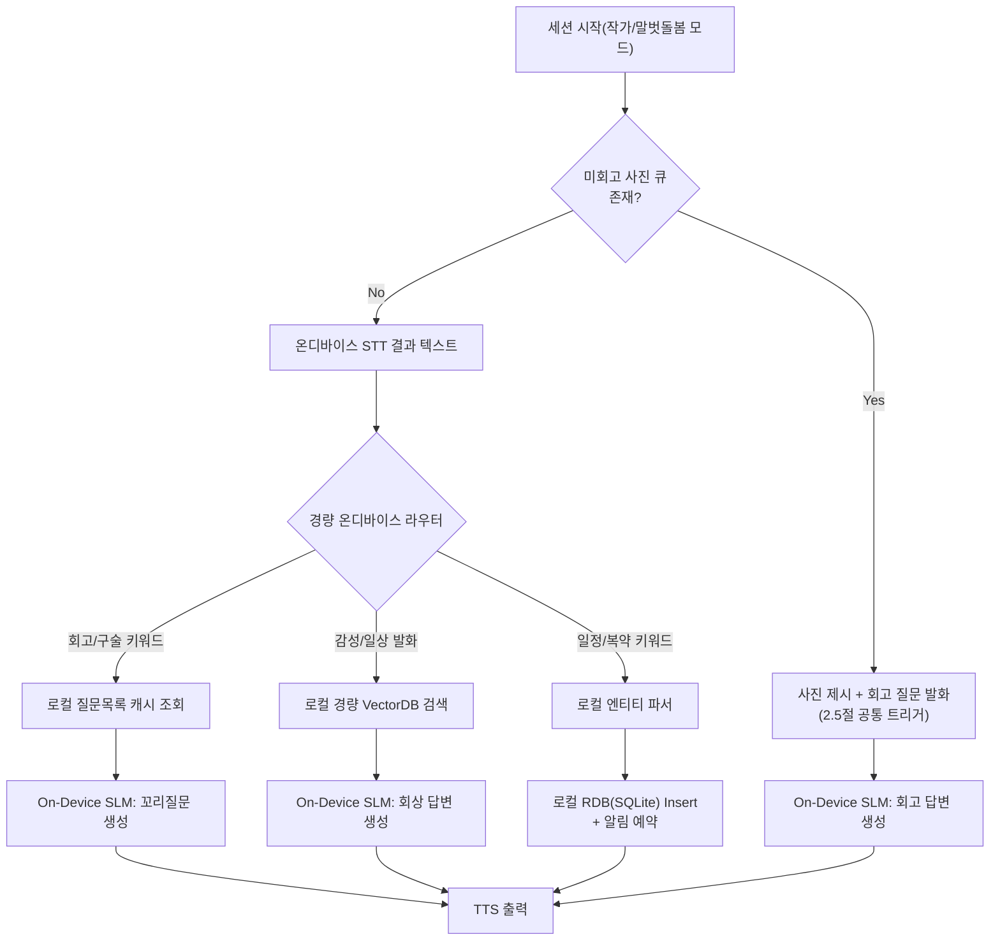
```mermaid
flowchart TD
    Start["세션 시작(작가/말벗돌봄 모드)"] --> PhotoQ{"미회고 사진 큐<br/>존재?"}
    PhotoQ -- "Yes" --> PhotoPresent["사진 제시 + 회고 질문 발화<br/>(2.5절 공통 트리거)"]
    PhotoQ -- "No" --> Text
    PhotoPresent --> G["On-Device SLM: 회고 답변 생성"]
    Text["온디바이스 STT 결과 텍스트"] --> Router{"경량 온디바이스 라우터"}
    Router -- "회고/구술 키워드" --> A["로컬 질문목록 캐시 조회"]
    Router -- "감성/일상 발화" --> B["로컬 경량 VectorDB 검색"]
    Router -- "일정/복약 키워드" --> C["로컬 엔티티 파서"]
    A --> D["On-Device SLM: 꼬리질문 생성"]
    B --> E["On-Device SLM: 회상 답변 생성"]
    C --> F["로컬 RDB(SQLite) Insert<br/>+ 알림 예약"]
    D --> TTS["TTS 출력"]
    E --> TTS
    F --> TTS
    G --> TTS
```

> ※ 미회고 사진이 있으면 세션 시작 시 기존 질문목록·RAG 회상보다 우선 제시됩니다. 사진 회고 응답은 사진 ID와 함께 로컬 저장되어 2.5절 파이프라인을 통해 챕터에 인라인 편입됩니다.

### 3.3 로컬 RAG 회상 흐름 (말벗돌봄 모드, 오프라인)

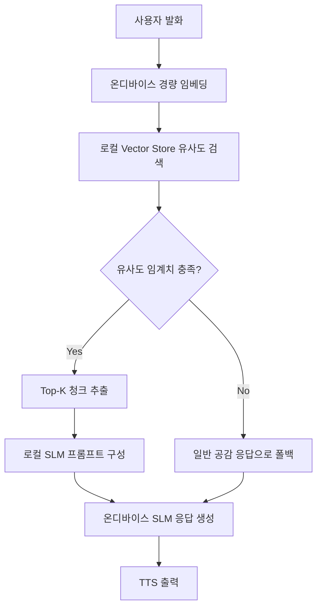
```mermaid
flowchart TD
    Query["사용자 발화"] --> Embed["온디바이스 경량 임베딩"]
    Embed --> Search["로컬 Vector Store 유사도 검색"]
    Search --> Score{"유사도 임계치 충족?"}
    Score -- "Yes" --> TopK["Top-K 청크 추출"]
    Score -- "No" --> Fallback["일반 공감 응답으로 폴백"]
    TopK --> Context["로컬 SLM 프롬프트 구성"]
    Context --> Gen["온디바이스 SLM 응답 생성"]
    Fallback --> Gen
    Gen --> TTS["TTS 출력"]
```

### 3.4 로컬 비서(일정) 흐름 (오프라인)

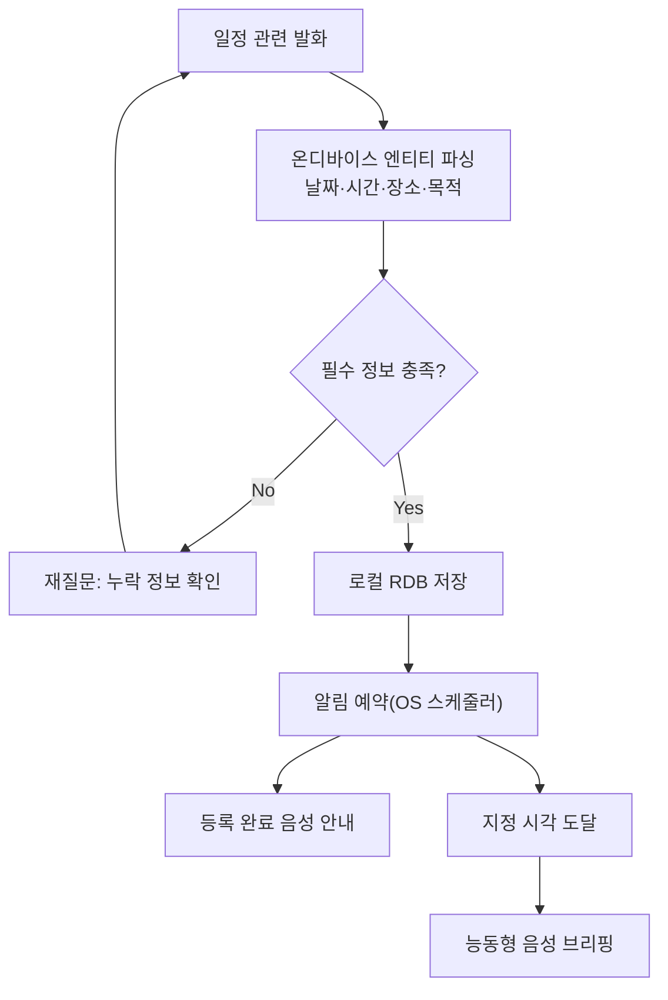
```mermaid
flowchart TD
    Speech["일정 관련 발화"] --> Parse["온디바이스 엔티티 파싱<br/>날짜·시간·장소·목적"]
    Parse --> Valid{"필수 정보 충족?"}
    Valid -- "No" --> Clarify["재질문: 누락 정보 확인"]
    Clarify --> Speech
    Valid -- "Yes" --> Save["로컬 RDB 저장"]
    Save --> Schedule["알림 예약(OS 스케줄러)"]
    Schedule --> Confirm["등록 완료 음성 안내"]
    Schedule --> Trigger["지정 시각 도달"]
    Trigger --> Push["능동형 음성 브리핑"]
```

### 3.5 Wi-Fi 동기화 상태 흐름

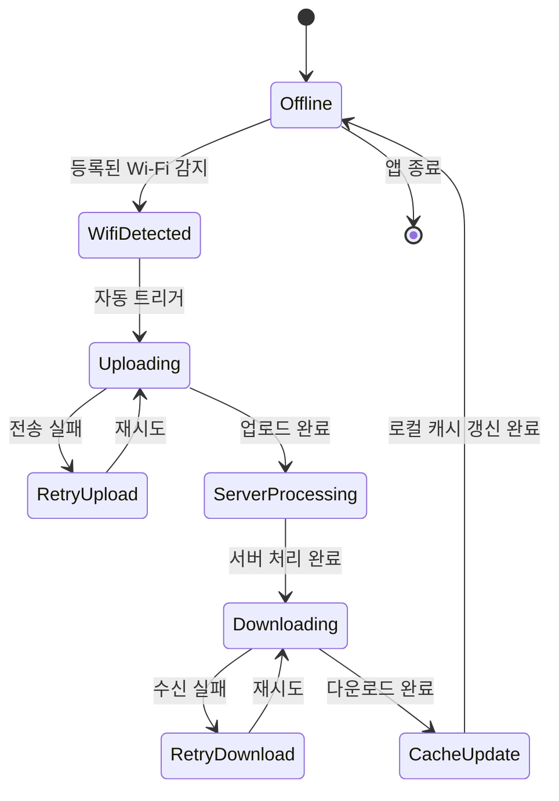
```mermaid
stateDiagram-v2
    [*] --> Offline
    Offline --> WifiDetected: 등록된 Wi-Fi 감지
    WifiDetected --> Uploading: 자동 트리거
    Uploading --> RetryUpload: 전송 실패
    RetryUpload --> Uploading: 재시도
    Uploading --> ServerProcessing: 업로드 완료
    ServerProcessing --> Downloading: 서버 처리 완료
    Downloading --> RetryDownload: 수신 실패
    RetryDownload --> Downloading: 재시도
    Downloading --> CacheUpdate: 다운로드 완료
    CacheUpdate --> Offline: 로컬 캐시 갱신 완료
    Offline --> [*]: 앱 종료
```

### 3.6 설치모드 자동 분기 흐름 — 키오스크 / 일반 앱 (신규)

앱 설치 시점에 단말 사양을 자동 체크하여, 저사양·재활용 단말은 키오스크 모드로, 고사양 개인 단말은 일반 앱 모드로 설치합니다. 두 모드의 앱 기능은 동일하며 설치·잠금 방식만 다릅니다.

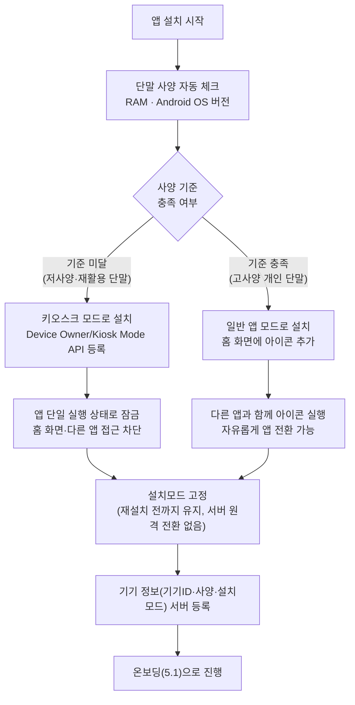
```mermaid
flowchart TD
    Start["앱 설치 시작"] --> Check["단말 사양 자동 체크<br/>RAM · Android OS 버전"]
    Check --> Judge{"사양 기준<br/>충족 여부"}
    Judge -- "기준 미달\n(저사양·재활용 단말)" --> Kiosk["키오스크 모드로 설치<br/>Device Owner/Kiosk Mode API 등록"]
    Judge -- "기준 충족\n(고사양 개인 단말)" --> Normal["일반 앱 모드로 설치<br/>홈 화면에 아이콘 추가"]
    Kiosk --> KioskLock["앱 단일 실행 상태로 잠금<br/>홈 화면·다른 앱 접근 차단"]
    Normal --> NormalIcon["다른 앱과 함께 아이콘 실행<br/>자유롭게 앱 전환 가능"]
    KioskLock --> Fixed["설치모드 고정<br/>(재설치 전까지 유지, 서버 원격 전환 없음)"]
    NormalIcon --> Fixed
    Fixed --> Register["기기 정보(기기ID·사양·설치모드) 서버 등록"]
    Register --> Onboard["온보딩(5.1)으로 진행"]
```

- **판별 기준**: RAM 용량, Android OS 버전 등 하드웨어 사양을 설치 시점에 자동 체크 — 구체적 임계값은 별도 기술 검토로 확정
- **앱 기능 동일성**: 키오스크 모드와 일반 앱 모드는 3대 운영 모드를 포함한 모든 기능이 완전히 동일하며, 설치·잠금 방식만 다름
- **고정 원칙**: 설치 시 1회 결정된 모드는 재설치 전까지 유지되며, 서버에서 원격으로 모드를 전환하거나 잠금을 해제하는 기능은 두지 않음 — 서버는 기기별 설치모드를 조회만 가능

---

## 4. 서버측 모듈 흐름

### 4.1 API Gateway · 오케스트레이터 라우팅

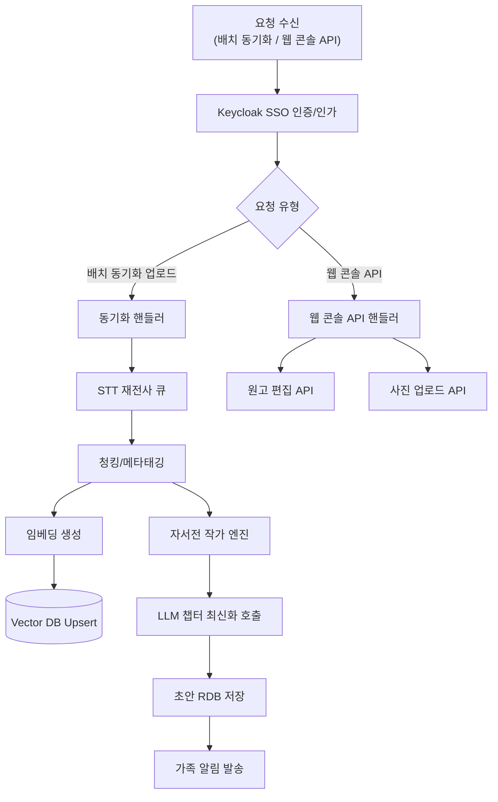
```mermaid
flowchart TD
    Req["요청 수신<br/>(배치 동기화 / 웹 콘솔 API)"] --> Auth["Keycloak SSO 인증/인가"]
    Auth --> TypeCheck{"요청 유형"}
    TypeCheck -- "배치 동기화 업로드" --> SyncHandler["동기화 핸들러"]
    TypeCheck -- "웹 콘솔 API" --> WebHandler["웹 콘솔 API 핸들러"]

    SyncHandler --> STTQueue["STT 재전사 큐"]
    STTQueue --> Chunk["청킹/메타태깅"]
    Chunk --> Embed["임베딩 생성"]
    Embed --> VDBUpsert[("Vector DB Upsert")]
    Chunk --> AuthorEngine["자서전 작가 엔진"]
    AuthorEngine --> LLMCall["LLM 챕터 최신화 호출"]
    LLMCall --> DraftStore["초안 RDB 저장"]
    DraftStore --> NotifyFamily["가족 알림 발송"]

    WebHandler --> EditAPI["원고 편집 API"]
    WebHandler --> PhotoAPI["사진 업로드 API"]
```

### 4.2 자서전 최신화 배치 처리

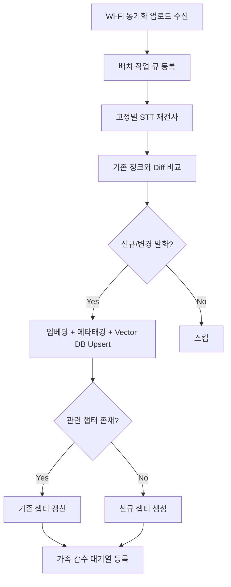
```mermaid
flowchart TD
    Trigger["Wi-Fi 동기화 업로드 수신"] --> Batch["배치 작업 큐 등록"]
    Batch --> STT["고정밀 STT 재전사"]
    STT --> Diff["기존 청크와 Diff 비교"]
    Diff --> New{"신규/변경 발화?"}
    New -- "Yes" --> Process["임베딩 + 메타태깅 + Vector DB Upsert"]
    New -- "No" --> Skip["스킵"]
    Process --> ChapterCheck{"관련 챕터 존재?"}
    ChapterCheck -- "Yes" --> UpdateChapter["기존 챕터 갱신"]
    ChapterCheck -- "No" --> NewChapter["신규 챕터 생성"]
    UpdateChapter --> Review["가족 감수 대기열 등록"]
    NewChapter --> Review
```

### 4.3 정서 모니터링 · 알림 흐름

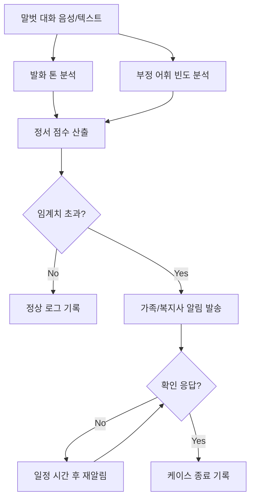
```mermaid
flowchart TD
    Voice["말벗 대화 음성/텍스트"] --> Tone["발화 톤 분석"]
    Voice --> Word["부정 어휘 빈도 분석"]
    Tone --> Score["정서 점수 산출"]
    Word --> Score
    Score --> Threshold{"임계치 초과?"}
    Threshold -- "No" --> Log["정상 로그 기록"]
    Threshold -- "Yes" --> Escalate["가족/복지사 알림 발송"]
    Escalate --> Ack{"확인 응답?"}
    Ack -- "No" --> Reminder["일정 시간 후 재알림"]
    Reminder --> Ack
    Ack -- "Yes" --> Close["케이스 종료 기록"]
```

---

## 5. 분야별 업무 프로세스 흐름도

### 5.1 신규 사용자 온보딩 프로세스

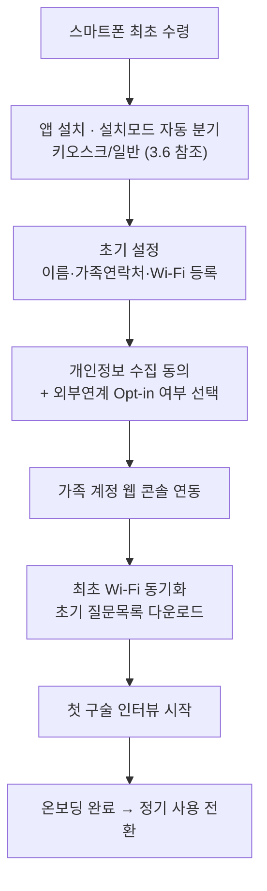
```mermaid
flowchart TD
    Start["스마트폰 최초 수령"] --> InstallMode["앱 설치 · 설치모드 자동 분기<br/>키오스크/일반 (3.6 참조)"]
    InstallMode --> Setup["초기 설정<br/>이름·가족연락처·Wi-Fi 등록"]
    Setup --> Consent["개인정보 수집 동의<br/>+ 외부연계 Opt-in 여부 선택"]
    Consent --> Pairing["가족 계정 웹 콘솔 연동"]
    Pairing --> InitSync["최초 Wi-Fi 동기화<br/>초기 질문목록 다운로드"]
    InitSync --> FirstInterview["첫 구술 인터뷰 시작"]
    FirstInterview --> End["온보딩 완료 → 정기 사용 전환"]
```

### 5.2 자서전 제작 전체 라이프사이클 (매크로 흐름)

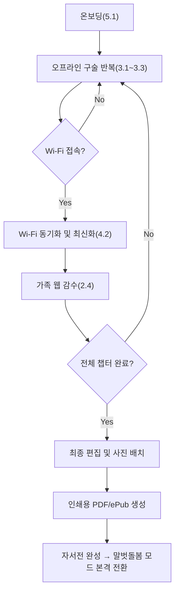
```mermaid
flowchart TD
    A["온보딩(5.1)"] --> B["오프라인 구술 반복(3.1~3.3)"]
    B --> C{"Wi-Fi 접속?"}
    C -- "No" --> B
    C -- "Yes" --> D["Wi-Fi 동기화 및 최신화(4.2)"]
    D --> E["가족 웹 감수(2.4)"]
    E --> F{"전체 챕터 완료?"}
    F -- "No" --> B
    F -- "Yes" --> G["최종 편집 및 사진 배치"]
    G --> H["인쇄용 PDF/ePub 생성"]
    H --> I["자서전 완성 → 말벗돌봄 모드 본격 전환"]
```

### 5.3 말벗돌봄 일일 운영 프로세스

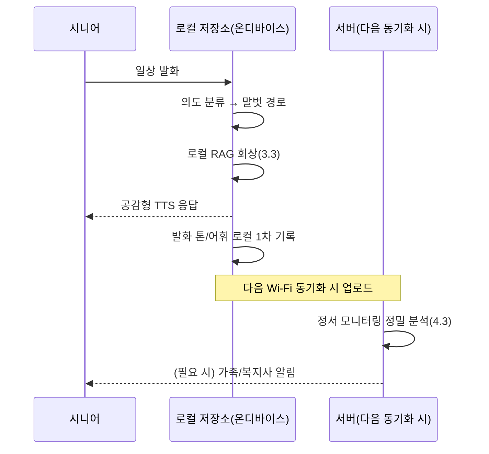
```mermaid
sequenceDiagram
    participant S as 시니어
    participant L as 로컬 저장소(온디바이스)
    participant AI as 서버(다음 동기화 시)

    S->>L: 일상 발화
    L->>L: 의도 분류 → 말벗 경로
    L->>L: 로컬 RAG 회상(3.3)
    L-->>S: 공감형 TTS 응답
    L->>L: 발화 톤/어휘 로컬 1차 기록
    Note over L,AI: 다음 Wi-Fi 동기화 시 업로드
    AI->>AI: 정서 모니터링 정밀 분석(4.3)
    AI-->>S: (필요 시) 가족/복지사 알림
```

### 5.4 비서모드 — 복약 관리 순환 프로세스

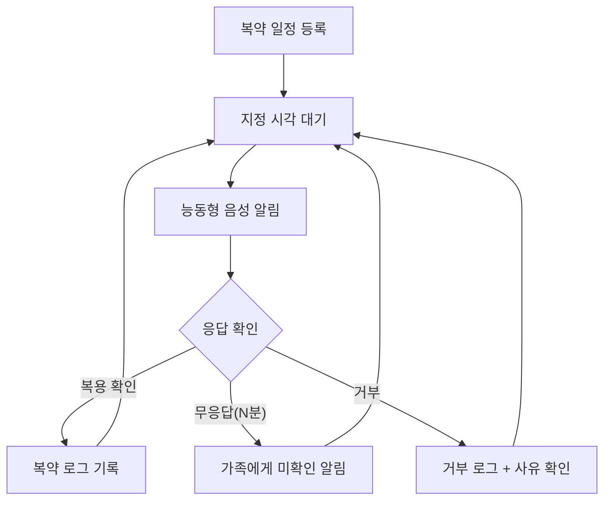
```mermaid
flowchart TD
    Register["복약 일정 등록"] --> Wait["지정 시각 대기"]
    Wait --> Push["능동형 음성 알림"]
    Push --> Response{"응답 확인"}
    Response -- "복용 확인" --> Log["복약 로그 기록"]
    Response -- "무응답(N분)" --> Escalate["가족에게 미확인 알림"]
    Response -- "거부" --> LogSkip["거부 로그 + 사유 확인"]
    Log --> Wait
    LogSkip --> Wait
    Escalate --> Wait
```

### 5.5 가족 협업 · 감수 프로세스

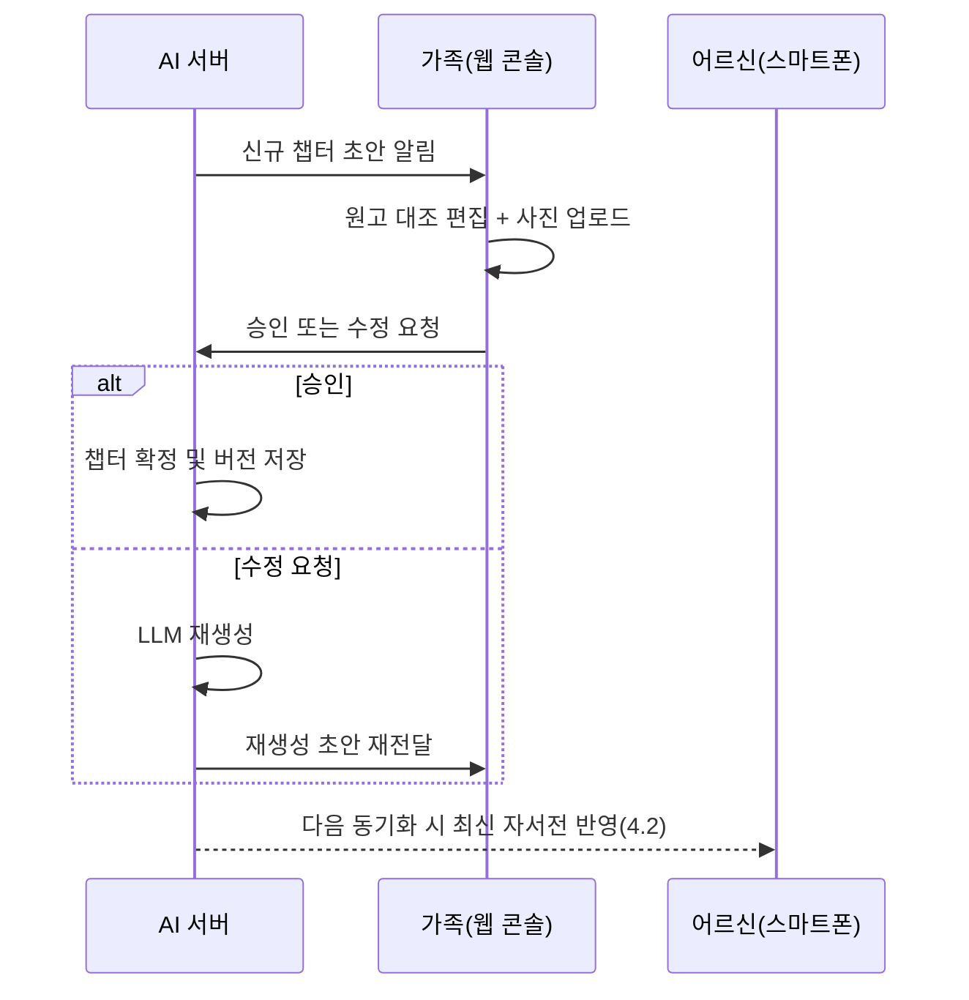
```mermaid
sequenceDiagram
    participant AI as AI 서버
    participant F as 가족(웹 콘솔)
    participant P as 어르신(스마트폰)

    AI->>F: 신규 챕터 초안 알림
    F->>F: 원고 대조 편집 + 사진 업로드
    F->>AI: 승인 또는 수정 요청
    alt 승인
        AI->>AI: 챕터 확정 및 버전 저장
    else 수정 요청
        AI->>AI: LLM 재생성
        AI->>F: 재생성 초안 재전달
    end
    AI-->>P: 다음 동기화 시 최신 자서전 반영(4.2)
```

### 5.6 동기화 실패 · 충돌 해결 프로세스

```mermaid
flowchart TD
    Sync["Wi-Fi 동기화 시도"] --> UploadCheck{"업로드 성공?"}
    UploadCheck -- "No" --> Retry1["지수 백오프 재시도<br/>(최대 N회)"]
    Retry1 --> UploadCheck
    UploadCheck -- "Yes" --> DownloadCheck{"다운로드 성공?"}
    DownloadCheck -- "No" --> Retry2["재시도"]
    Retry2 --> DownloadCheck
    DownloadCheck -- "Yes" --> Integrity{"체크섬 검증 통과?"}
    Integrity -- "No" --> Discard["손상 데이터 폐기<br/>재다운로드 요청"]
    Discard --> DownloadCheck
    Integrity -- "Yes" --> Conflict{"로컬-서버 버전 충돌?"}
    Conflict -- "Yes" --> ServerWins["서버 마스터 데이터 우선 적용"]
    Conflict -- "No" --> Apply["로컬 캐시 정상 갱신"]
    ServerWins --> Apply
    Apply --> Done["동기화 완료"]
```

### 5.7 사진 회고 협업 프로세스 (가족·당사자·서버 공통, 신규)

가족과 당사자 양쪽 모두가 사진의 출처가 될 수 있고, 그 결과가 자서전 콘텐츠로 자연스럽게 흡수되는 협업 흐름을 주체 중심으로 정리한 것입니다. 기술적 상세는 2.5절을 참조합니다.

```mermaid
sequenceDiagram
    participant F as 가족(웹)
    participant P as 당사자(스마트폰)
    participant AI as AI 서버

    alt 가족이 사진 업로드
        F->>AI: 사진 업로드 (WF3)
    else 당사자가 사진 업로드
        P->>AI: 사진 촬영·선택 업로드
    end
    AI->>AI: 미회고 사진 큐 등록(연도 태그 기반 예상 챕터 매핑)
    AI-->>P: 다음 Wi-Fi 동기화 시 미회고 큐 전달
    P->>P: 대화 세션 시작 시 사진 우선 제시(3.2)
    P-->>AI: 회고 음성·전사텍스트 + 사진 ID (다음 동기화 시 업로드)
    AI->>AI: 자서전 작가 엔진 처리(2.1) → 챕터 본문 인라인 삽입
    AI->>F: 감수 대기열 알림 (2.4)
    F->>F: 챕터 내 사진 위치·설명 조정(선택)
    F-->>P: 확정본 다음 동기화 시 반영
```

---

*— 이하 여백 —*
