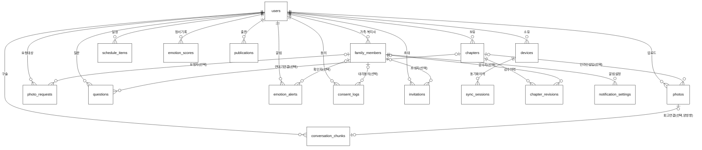
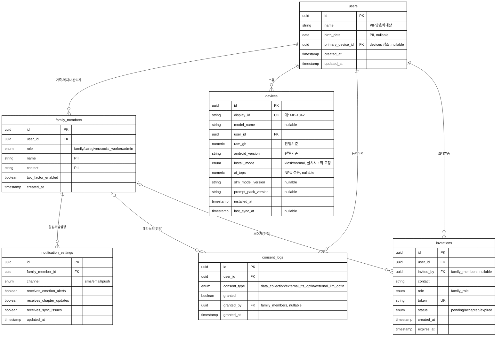
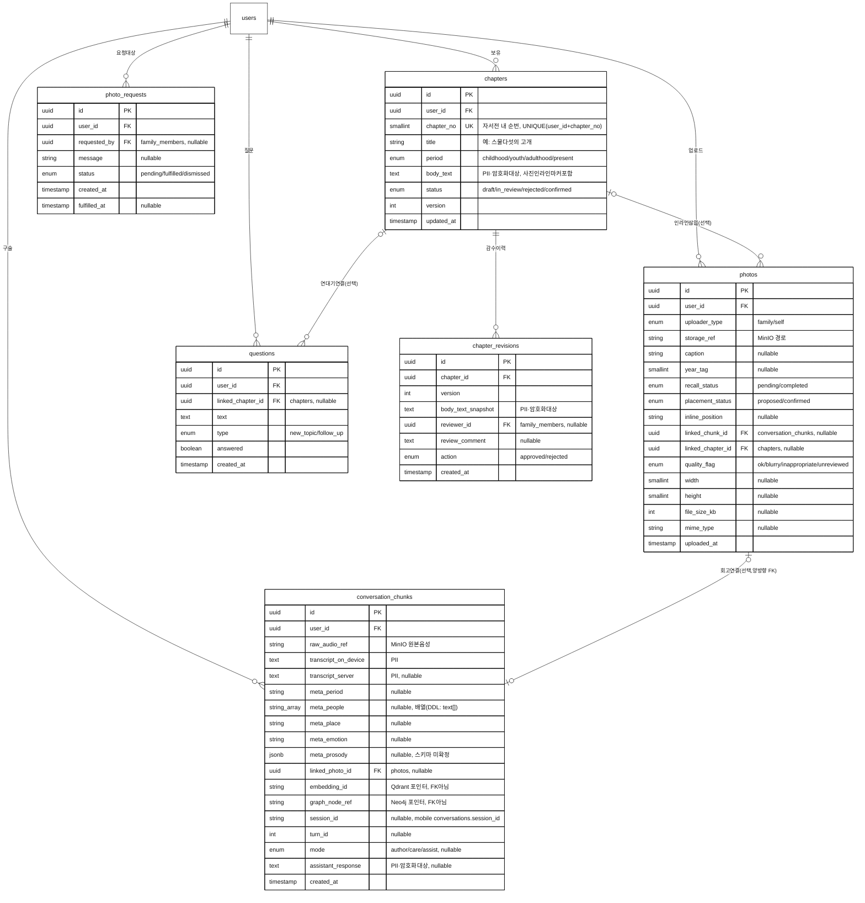
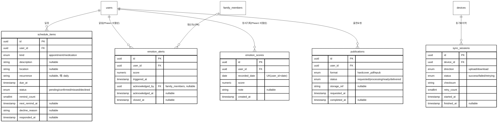
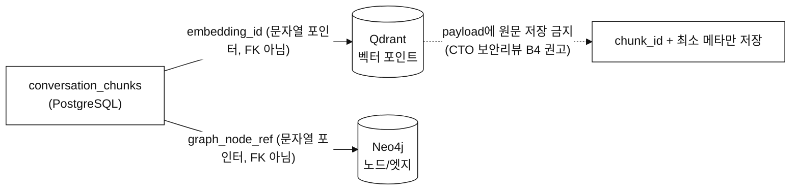

# 데이터 모델링 및 ERD (Entity-Relationship Diagram)

> **Summary**: [`schema.md`](./schema.md)(v1.4, PostgreSQL DDL)와 [`mobile-schema.md`](./mobile-schema.md)(온디바이스 SQLite)를 시각적 ER 다이어그램으로 정리한 데이터 모델링 문서
>
> **Project**: 은빛실타래 (SilverYarn)
> **Date**: 2026-09-07
> **Version**: 1.2 (3차 design-validator 검증 H-1 반영 — PII 암호화 대상에 assistant_response 추가, §11 스테일 버전 문구 정정)
> **Status**: Draft
> **DDL 원본(SoR)**: [`schema.md`](./schema.md) — 본 문서와 실제 컬럼 타입·길이가 다르면 schema.md가 우선한다.

> **표기 규칙(흑백판)**: [workflow-diagrams.md](../02-design/workflow-diagrams.md)에서 정한 흑백 고대비 원칙을 동일하게 적용한다. 모든 다이어그램에 흑백 강제 테마 지시자를 넣었고, 구분은 색이 아니라 **카디널리티 기호**(`||`, `o{`, `|o` 등)와 **PK/FK/UK 키 마커**로만 표현한다.

---

## 1. 모델링 원칙

| 원칙 | 내용 |
|---|---|
| **소유 루트(Ownership Root)** | 모든 엔티티는 직접 또는 간접으로 `users`(어르신 본인)에 귀속된다 — 멀티테넌트가 아닌 "1 시니어 = 1 데이터 트리" 구조 |
| **PK 전략** | 전 테이블 `UUID`(`gen_random_uuid()`) — 분산 생성(온디바이스↔서버 동시 생성) 및 동기화 시 충돌 방지를 위해 자동증가 정수 대신 채택 |
| **Enum 정책** | DB enum 값은 항상 **영문**(`childhood` 등), 한글 표시명은 [schema.md §7](./schema.md#7-enum-표시명-매핑-한글-ui--영문-db-값) 매핑 테이블로만 노출 (decisions.md #21) |
| **참조 무결성** | `user_id` 등 소유 관계 FK는 전부 `ON DELETE CASCADE` — 시니어 계정 삭제 시 종속 데이터 일괄 정리. **단, 이는 "삭제·파기 정책"이 아직 미확정인 상태의 잠정 규칙**이다(§8 각주 참조) |
| **의도적 비정규화 1** | `conversation_chunks.meta_people`을 `TEXT[]` 배열로 저장(정규화된 조인 테이블 대신) — RAG 인물 필터링 조회가 압도적으로 많고 다인물 태깅이 자연스러워 배열이 더 적합 |
| **의도적 비정규화 2** | `photos.linked_chunk_id`와 `conversation_chunks.linked_photo_id`가 **같은 관계를 양방향 FK로 중복 저장** — 사진→회고청크, 청크→사진 양쪽에서 인덱스 조회가 빈번해 조인 비용보다 중복 저장을 선택. 애플리케이션 레벨에서 양쪽 동시 갱신 책임 필요 |
| **비관계형 저장소 연계** | `conversation_chunks.embedding_id`(Qdrant), `graph_node_ref`(Neo4j)는 **진짜 FK가 아니라 외부 시스템 포인터 문자열**이다 — PostgreSQL이 참조 무결성을 보장하지 않으므로 애플리케이션이 정합성을 책임진다(§7 참조) |
| **PII 암호화** | `name`/`contact`/`body_text`/`body_text_snapshot`/`transcript_*`/`birth_date`/**`assistant_response`** 컬럼은 암호화 대상으로 지정만 되어 있고 **구체 방식(pgcrypto vs 앱레벨)은 Do 단계 미확정** (schema.md §8, §5) *(v1.2: `assistant_response` 누락분을 3차 검증 H-1로 정정)* |

---

## 2. 전체 관계 개요 (엔티티 17개, 속성 생략)



---

## 3. 도메인 A — 사용자 · 기기 · 거버넌스

`users`, `family_members`, `devices`, `consent_logs`, `notification_settings`, `invitations` — 신원·단말·동의·알림설정을 다루는 영역.



> 🕒 `users.primary_device_id`는 `devices`를 가리키는 **보조 참조**(순환 참조 방지를 위해 `ALTER TABLE`로 후행 추가, schema.md §5)다. 소유 관계의 정본은 `devices.user_id`(NOT NULL)이며, `primary_device_id`는 "여러 단말 중 주 단말이 어느 것인지"만 표시하는 선택적 포인터라 위 다이어그램에서는 관계선으로 별도 표기하지 않았다.

---

## 4. 도메인 B — 자서전 · 구술 · 사진

`chapters`, `chapter_revisions`, `photos`, `photo_requests`, `conversation_chunks`, `questions` — 자서전 콘텐츠 생성·감수·회고 파이프라인의 핵심 데이터.



---

## 5. 도메인 C — 비서 · 정서 · 운영

`schedule_items`, `emotion_alerts`, `emotion_scores`, `sync_sessions`, `publications` — 비서 모드, 정서 모니터링(Phase 1 비활성), 동기화·출판 운영 데이터.



> ⚠️ `emotion_alerts`·`emotion_scores`는 스키마(DDL)는 존재하나 **write 경로가 Phase 1 피처플래그로 비활성**이다(decisions.md #25) — 법무·윤리 검토(#12) 완료 전까지 애플리케이션 코드에서 이 두 테이블에 아무것도 쓰지 않는다.

---

## 6. 온디바이스 로컬 ERD (SQLite) ↔ 서버 매핑

[`mobile-schema.md`](./mobile-schema.md)의 6개 로컬 테이블은 서버 스키마의 **서브셋/캐시**이며 별도 DB(SQLite)라 PostgreSQL과 FK로 직접 연결되지 않는다 — [design.md §4](../02-design/features/silveryarn-platform.design.md) 동기화 API를 통해서만 데이터가 오간다.

```mermaid
%%{init: {'theme':'base', 'themeVariables': {'primaryColor':'#ffffff','primaryTextColor':'#111111','primaryBorderColor':'#111111','lineColor':'#111111','background':'#ffffff','mainBkg':'#ffffff','textColor':'#111111','clusterBkg':'#ffffff','clusterBorder':'#111111'}}}%%
erDiagram
    conversations {
        text id PK "서버 conversation_chunks.id 재사용(멱등키)"
        text session_id
        int turn_id
        text mode "author/care/assist"
        text user_query
        text assistant_response
        text audio_path "업로드 성공시 NULL(#30)"
        text linked_chapter_id "nullable"
        int response_latency_ms "nullable"
        text sync_status "PENDING/UPLOADING/SYNCED/FAILED"
        int created_at "epoch ms"
    }
    autobiography_fts {
        text chapter_id UNINDEXED
        text chapter_no UNINDEXED
        text period UNINDEXED
        text summary "FTS5 전문색인 대상"
        text keywords "FTS5 전문색인 대상"
    }
    questions_cache {
        text id PK "서버 questions.id"
        text linked_chapter_id "nullable"
        text text
        text type
        int answered
        int priority
    }
    unrecalled_photos {
        text id PK "서버 photos.id"
        text storage_ref_local
        text caption "nullable"
        int year_tag "nullable"
    }
    schedule_cache {
        text id PK
        text kind
        text description "nullable"
        text location "nullable"
        int due_at "epoch ms"
        text status
        int remind_count
        text origin "server/local"
    }
    device_state {
        text install_mode "단일행"
        text registered_wifi_ssid "로컬전용, 서버미전송(#22)"
        text slm_model_version "nullable"
        text prompt_pack_version "nullable"
        int last_sync_at "nullable"
    }
```

| 로컬 테이블 | 서버 대응 엔티티 | 동기화 방향 |
|---|---|---|
| `conversations` | `conversation_chunks` | 업로드(→서버), ID를 멱등키로 재사용 |
| `autobiography_fts` | `chapters` (요약본) | 다운로드(←서버), `chapter_updates` 페이로드 — 컬럼명을 페이로드와 동일하게 정렬(v1.1, `period_era`→`period`, `content`→`summary`, `chapter_no` 추가) |
| `questions_cache` | `questions` | 다운로드(←서버), `priority_questions` 페이로드 |
| `unrecalled_photos` | `photos`(recall_status=pending) | 다운로드(←서버) |
| `schedule_cache` | `schedule_items` | 양방향 (`origin=local`분은 업로드) |
| `device_state` | `devices` (일부 필드) | 설치 시 1회 등록 + 조회 |

---

## 7. 비관계형 저장소 연계 (Qdrant · Neo4j)

`conversation_chunks`의 `embedding_id`·`graph_node_ref`는 **PostgreSQL 외부의 시스템을 가리키는 문자열 포인터**이며, DB 레벨 FK 제약이 없다 — 참조 무결성은 애플리케이션(author-engine, rag-core)이 책임진다.



> **CTO 보안 리뷰 반영 사항 (B4, [cto-review](../02-design/cto-review-2026-09-05.md#3-security-architect--보안법무-심사-가장-중대))**: BGE-M3 임베딩은 역변환(embedding inversion) 공격으로 원문이 일부 복원될 수 있어 **벡터 자체가 PII**로 취급된다. Qdrant payload에는 원문 텍스트를 저장하지 않고 `chunk_id`와 최소 메타(시기·인물 필터용)만 둔다 — Do 단계 구현 시 반드시 준수.

---

## 8. 관계 카디널리티 & 참조 무결성 정책 요약

| 관계 | 카디널리티 | ON DELETE | 비고 |
|---|---|---|---|
| users → family_members | 1:N | CASCADE | 시니어 삭제 시 가족 레코드도 정리(아래 각주 재검토 필요) |
| users → devices | 1:N | CASCADE | |
| users → chapters | 1:N | CASCADE | |
| chapters → chapter_revisions | 1:N | CASCADE | |
| users → devices (primary_device_id) | 0..1:1 | **SET NULL** (v1.3) | 주 단말 지정용 보조 참조 — 소유관계 정본은 `devices.user_id`(CASCADE) |
| chapters → photos (linked_chapter_id) | 0..1:0..N | 제약없음(FK만) | 인라인 삽입 시에만 연결 |
| chapters → questions (linked_chapter_id) | 1:0..N | 제약없음(FK만) | |
| photos ↔ conversation_chunks | 0..1:0..1 | 제약없음(FK만) | **양방향 FK 중복** — 애플리케이션이 양쪽 동시 갱신 |
| family_members → notification_settings | 1:N | CASCADE | |
| family_members → chapter_revisions(reviewer_id) | 0..1:N | 제약없음(NULL 허용) | 감수자 탈퇴해도 이력은 유지 |
| family_members → emotion_alerts(acknowledged_by) | 0..1:N | 제약없음 | |
| family_members → consent_logs(granted_by) | 0..1:N | 제약없음 | |
| family_members → invitations(invited_by) | 0..1:N | 제약없음 | |
| family_members → photo_requests(requested_by) | 0..1:N | 제약없음 | |
| devices → sync_sessions | 1:N | CASCADE | |
| users → 나머지 10개 엔티티(photos/photo_requests/conversation_chunks/questions/schedule_items/emotion_alerts/emotion_scores/consent_logs/invitations/publications) | 1:N | CASCADE | 소유 루트 원칙 일괄 적용 |

> ⚠️ **CASCADE 삭제와 보유·파기 정책의 충돌 가능성**: 현재 전 관계가 `ON DELETE CASCADE`인데, CTO 보안 리뷰(B3)는 "원본 음성·전사·벡터 각각의 보유기간·파기방법이 법무 미확정"이라고 지적했다. 만약 향후 법무 검토에서 "즉시 완전삭제"가 아니라 "일정기간 보관 후 파기" 또는 "사용자별 암호키 폐기(crypto-shredding)" 방식이 채택되면, 지금의 단순 CASCADE는 재설계가 필요하다 — Do 단계 착수 전 확정 권장([decisions.md](./decisions/silveryarn-platform.decisions.md) 미결 항목).

---

## 9. 정규화 수준

- 전 테이블 **3NF(제3정규형)** 준수를 기본으로 하되, §1에 명시한 2건(`meta_people` 배열, `photos`↔`conversation_chunks` 양방향 FK)만 조회 성능·구현 단순성을 위해 의도적으로 비정규화했다.
- `meta_prosody`(JSONB)는 정서분석 모듈의 세부 스키마가 아직 없어 **스키마리스로 잠정 저장** — 구조가 확정되면 정규 컬럼으로 승격을 검토한다(schema.md §8).
- Enum은 PostgreSQL 네이티브 `ENUM` 타입 사용 — 값 추가 시 `ALTER TYPE ... ADD VALUE` 마이그레이션 필요(Alembic).

---

## 10. 인덱스 전략 (schema.md §5 기준)

| 인덱스 | 대상 | 근거 |
|---|---|---|
| `idx_chapters_user` | `chapters(user_id)` | 사용자별 챕터 목록 조회(가장 빈번) |
| `idx_photos_user_recall` | `photos(user_id, recall_status)` | 미회고 큐 조회(대화 세션 시작마다 실행) |
| `idx_chunks_user` | `conversation_chunks(user_id)` | RAG 컨텍스트 조회 |
| `idx_schedule_user_due` | `schedule_items(user_id, due_at)` | 다가오는 일정/복약 조회 |
| `idx_sync_device` | `sync_sessions(device_id, started_at DESC)` | 동기화 모니터링(관리자 WA3) |
| `idx_emotion_scores_user_date` | `emotion_scores(user_id, recorded_date DESC)` | 정서 추이 차트(Phase 1 비활성이나 인덱스는 선반영) |
| `idx_devices_display_id` | `devices(display_id)` | 관리자 기기 검색(WA6) |

> Do 단계에서 실사용 쿼리 패턴(EXPLAIN ANALYZE 기반)에 따라 복합 인덱스·부분 인덱스를 추가 보강한다(schema.md §6 체크리스트).

---

## 11. 알려진 확장 후보 (schema.md v1.4에도 미반영 — 결정 대기)

CTO 보안·백엔드 리뷰([cto-review-2026-09-05.md](../02-design/cto-review-2026-09-05.md))에서 구체적으로 제안됐으나, 이 문서(ERD)는 **schema.md 현재 확정 상태를 있는 그대로 시각화**하는 것이 목적이라 아래 항목은 반영하지 않았다. Do 단계 착수 전 별도 결정이 필요하다.

| 후보 엔티티/컬럼 | 목적 | 근거 |
|---|---|---|
| `access_logs` (신규 테이블) | 접속기록(누가·언제·무엇을 열람) 감사로그 | 「개인정보의 안전성 확보조치 기준」제8조, CTO 보안리뷰 B5(e) |
| `family_members.keycloak_sub` (UK 컬럼) | Keycloak 토큰 subject ↔ DB 행 매핑 (RBAC 강제의 전제조건) | CTO 보안리뷰 B5(a) |
| `device_credentials` (신규 테이블) | Device Token 발급·회전·폐기 이력 (분실단말 접근 차단) | CTO 보안리뷰 B5(b) |
| `organizations` + `family_members.org_id` | B2G 시설 단위 멀티테넌시(시설간 열람 차단) | CTO 보안리뷰 B5(c), decisions.md #1(B2C/B2G 병행) |
| `*.retention_until` / `*.purged_at` | 보유기간·파기 시점 관리 (crypto-shredding 등) | CTO 보안리뷰 B3, decisions.md 미결 항목 |

> 이 5가지를 지금 스키마에 반영할지 결정해주시면 schema.md 후속 버전으로 확정해서 이 ERD도 함께 갱신하겠습니다.

---

## Related Documents

- Schema(DDL, SoR): [schema.md](./schema.md)
- Mobile Schema: [mobile-schema.md](./mobile-schema.md)
- Glossary: [glossary.md](./glossary.md)
- CTO 보안·백엔드 리뷰: [cto-review-2026-09-05.md](../02-design/cto-review-2026-09-05.md)
- Design: [silveryarn-platform.design.md §3](../02-design/features/silveryarn-platform.design.md)
- Decisions: [silveryarn-platform.decisions.md](./decisions/silveryarn-platform.decisions.md)

---

## Version History

| Version | Date | Changes | Author |
|---------|------|---------|--------|
| 1.0 | 2026-09-07 | schema.md v1.2 + mobile-schema.md 기반 ERD 신규 작성 (흑백 고대비, 도메인별 3분할 + 온디바이스 매핑 + 비관계형 저장소 연계 다이어그램) | NUBiz AX Initiative |
| 1.1 | 2026-09-07 | 2차 design-validator 검증 반영 — schema.md v1.3 동기화(L-1~L-6) | NUBiz AX Initiative |
| 1.2 | 2026-09-07 | 3차 design-validator 검증 H-1 반영 — PII 암호화 대상 목록에 assistant_response 추가, §11 스테일 버전 문구("v1.2 확정 상태", "v1.3으로 확정") 정정 | NUBiz AX Initiative |
| 1.1 | 2026-09-07 | 2차 design-validator 검증(H-2/M-3/M-4/M-2 관련분) 반영 — schema.md v1.3 동기화(conversation_chunks 4컬럼·devices 2컬럼 추가), users→devices ON DELETE SET NULL 관계 추가, autobiography_fts 컬럼명 페이로드 정렬, 교차참조 오류 정정(§9→§8) | NUBiz AX Initiative |
