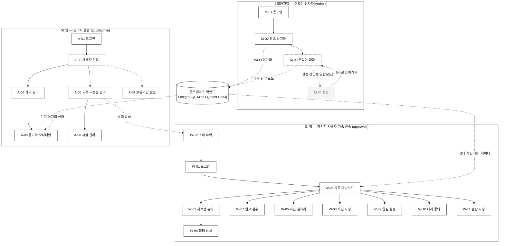
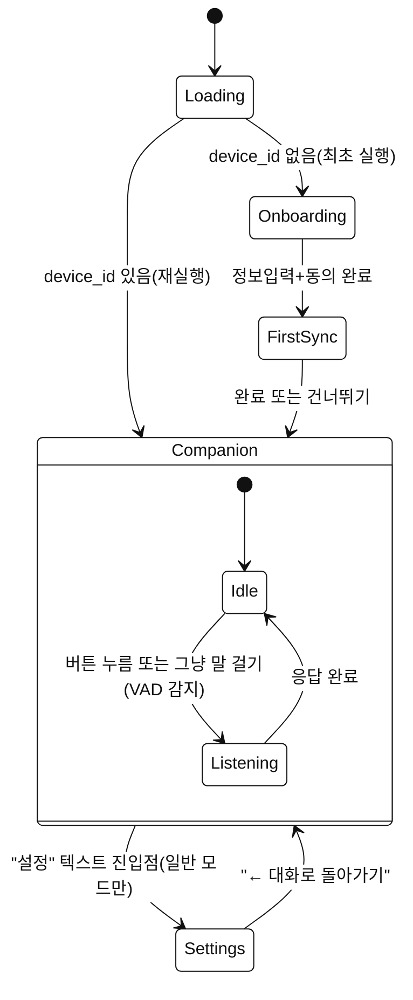
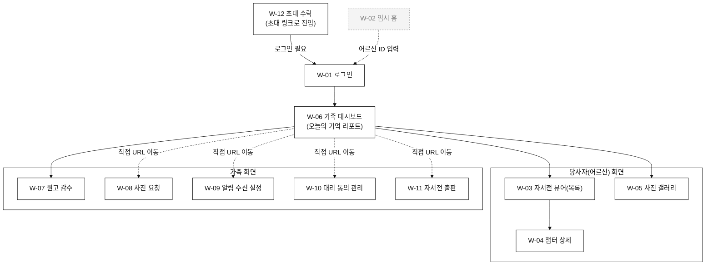
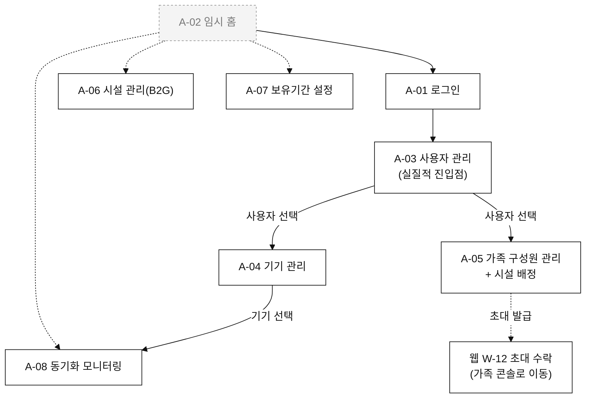

# 은빛실타래 — 화면설계서 (Screen Definition Document)

> **Summary**: 사용자 화면(UI/UX) 기준으로만 작성한 화면정의서 — 모바일앱(어르신 당사자)·웹(자서전 사용자·가족)·웹(관리자) 3영역, 실제 구현된 화면(2026-09-13 기준, 모바일 대화 전용 UI 전환 반영) 전수.
>
> **Project**: 은빛실타래 (SilverYarn)
> **Version**: 0.2 (모바일 대화 전용 UI 전환 반영 — decisions.md #66~#68)
> **Author**: NUBiz AX(AI Transformation) Initiative
> **Date**: 2026-09-13
> **Status**: Draft
> **관련 문서**: [`Plan/은빛실타래_UIUX_화면설계서.html`](../../Plan/은빛실타래_UIUX_화면설계서.html)(v1.2, 착수 전 원본 목업 — 화면 콘셉트·톤앤매너의 SoR), [`design.md §5.1`](./features/silveryarn-platform.design.md)(화면 인벤토리 요약), [`design-tokens.md`](./design-tokens.md)(컬러·타이포 토큰), [`workflow-diagrams.md`](./workflow-diagrams.md)(업무 프로세스 흐름 — 이 문서는 "화면" 관점, 그쪽은 "프로세스" 관점으로 상호 보완)

---

## 0. 문서 안내

### 0.1 범위와 SoR

이 문서는 **UI/UX 관점의 화면 정의만** 다룬다 — 화면 구성요소·사용자 액션·화면 전환. API 엔드포인트 상세 스펙은 `design.md §4`, 데이터 모델·엔티티는 `schema.md`/`mobile-schema.md`를 참조한다(중복 기술하지 않음).

CLAUDE.md SoR 원칙에 따라 **실제 구현된 코드**(`apps/web`, `apps/admin`, `apps/mobile`)가 기준이다 — `Plan/은빛실타래_UIUX_화면설계서.html`(원본 목업)과 다른 부분은 구현이 확정된 실제 동작이 우선이며, 그 차이를 각 화면 정의의 "비고"에 명시한다. 아직 코드가 없는 화면(스텁)은 원본 목업의 화면명·의도를 그대로 인용한다.

### 0.2 구현 상태 뱃지

| 뱃지 | 의미 |
|---|---|
| ✅ 구현완료 | 실 API/DB에 연동되어 정상 동작 |
| 🟡 부분구현(mock) | 화면·흐름·데이터 기록은 실물이나, 특정 구성요소가 의도적으로 가짜 응답으로 대체됨 |
| ⬜ 스텁 | "준비 중" 안내 문구만 있는 placeholder — 실제 기능 없음 |
| ⚠️ 임시방편 | 최종 기능(주로 Keycloak 실 로그인 세션→본인 식별) 자리를 임시 방편이 대신 채움 |
| 🔒 정책상 비활성 | 코드는 있으나 기능 자체가 피처플래그로 꺼져 있음(정서 모니터링, decisions.md #25) |

### 0.3 공통 UI 패턴 (전 화면 공통 — 화면별 정의에서 반복 기술하지 않음)

- **웹 2앱 공통**: `Card`/`Button`/`StatusBadge` 등 공유 컴포넌트는 `packages/web-shared`에서 가져온다(decisions.md #50). 에러는 항상 화면 내 배너 텍스트로 표시하고 별도 에러 페이지로 전환하지 않는다.
- **`?userId=` 쿼리스트링 패턴(웹 사용자·가족 콘솔 전 화면 공통, ⚠️ 임시방편)**: Keycloak 로그인 세션이 아직 "로그인한 나 = 어느 어르신/가족구성원"을 자동 해석하지 않아(실 인증은 세션 존재만 확인), 모든 화면이 URL 쿼리스트링으로 대상 어르신 `userId`를 직접 받는다. 최상위 진입점(W-02)이 이 값을 입력받아 각 화면으로 넘겨준다. 실 인증이 세션→본인 식별을 지원하면 이 패턴 전체가 제거된다.
- **가족 구성원 선택 2단계(W-09/W-10 공통, ⚠️ 임시방편)**: "본인 것만" 수정 가능한 화면(알림 설정·대리 동의)은 로그인 세션에서 "나"를 못 얻어, 구성원 목록에서 먼저 선택하는 중간 단계를 거친다.
- **모바일 상태 호이스팅**: Navigation 프레임워크·ViewModel 미도입(결정, 2026-09-09) — 화면 전환은 `sealed class`/`sealed interface` + `when` + 상태 호이스팅으로 구현. 화면 개수가 늘어나면 재검토 대상.

---

## 1. 전체 화면 흐름도 (Overview)

모바일앱·웹(사용자·가족)·웹(관리자) 3영역이 온프레미스 백엔드를 매개로 어떻게 맞물리는지 보여주는 최상위 흐름도. 각 영역의 상세 흐름은 Part A/B/C 첫머리에 별도로 있다.

> 범례: 실선=순차 전환, 점선 화살표=시스템 간 데이터 흐름, 점선 테두리 회색 노드(`M-04`)=스텁, 대시 테두리 흰 노드(`M-03`)=mock 부분구현.

---

# Part A. 모바일앱 (어르신 당사자용, Android 네이티브)

> **2026-09-13 개편**: 사용자 요청("어르신용 UI/UX는 대화형으로 — 모든 조작이 대화로 가능해야")에
> 따라 하단 4탭(대화/자서전/일정/설정)과 화면 4종(홈·말벗돌봄·작가모드·비서모드)을
> 걷어내고 **은실이 대화 화면(M-03) 하나로 통합**했다(decisions.md #66~#68). Part A는
> 이제 7개가 아니라 **4개** 화면이다.

## A.0 화면 흐름도

> 말하기 시작은 두 경로 모두 지원한다(사용자 요청) — 버튼을 누르거나, 그냥 말을 걸면
> `AmplitudeVoiceActivityDetector`가 진폭 임계값 초과를 스스로 감지한다. 두 경로 모두
> 종료 판정(무음 800ms)을 공유한다(design.md §2.12, decisions.md #68).

## A.1 M-01 온보딩

| 항목 | 내용 |
|---|---|
| 파일 | `presentation/onboarding/OnboardingScreen.kt` |
| 목적 | 최초 실행 시 어르신 정보 입력 + 개인정보 동의를 받아 서버에 사용자·기기를 등록한다 |
| 진입 경로 | 앱 최초 실행(`device_state.device_id`가 없음) |
| 구성 단계 | ① 정보입력(이름 필수·생년월일 선택) → ② 동의(개인정보 수집·이용 + 국외이전 동의(선택, 기본 미동의)) → ③ 처리중(계정·기기 등록 API 호출) → ④ 완료 또는 실패(재시도) |
| 주요 구성요소 | 이름/생년월일 입력 필드, 개인정보 수집·이용 안내문, 국외이전(FCM) 동의 체크박스+안내문, "동의하고 시작하기"/"이전"/"다시 시도" 버튼, 진행 스피너 |
| 다음 화면 | M-02 최초 동기화 |
| 구현 상태 | ✅ 구현완료 |
| 비고 | 국외이전 동의는 `data_collection`과 별개 항목(decisions.md #57 Q6) — 미동의해도 나머지 서비스는 그대로 쓸 수 있고 푸시알림만 못 받는다고 화면에 명시한다. |

## A.2 M-02 최초 동기화

| 항목 | 내용 |
|---|---|
| 파일 | `presentation/sync/FirstSyncScreen.kt` |
| 목적 | 온보딩 직후 1회 Wi-Fi 동기화를 실행해 서버의 자서전 스냅샷·질문 큐·일정을 로컬 캐시에 채운다 |
| 진입 경로 | 온보딩(M-01) 완료 직후 |
| 주요 구성요소 | 진행 스피너 + 안내 문구("자서전과 오늘의 질문을 불러오는 중"), 실패 시 "다시 시도"/"건너뛰기" 버튼 |
| 사용자 액션 | 실패해도 "건너뛰기"로 진입 가능(오프라인 우선 원칙) — 다음 Wi-Fi 접속 시 백그라운드 `SyncWorker`가 재시도 |
| 다음 화면 | M-03 은실이 대화 |
| 구현 상태 | ✅ 구현완료 |

## A.3 M-03 은실이 대화 (통합 홈)

| 항목 | 내용 |
|---|---|
| 파일 | `presentation/companion/CompanionScreen.kt` + `ConversationSessionController.kt` + `ondevice/vad/VoiceActivityDetector.kt` |
| 목적 | 어르신이 실제로 은실이와 대화하는 **유일한** 화면 — 회고·자서전 기록·사진·일정 안내까지 전부 이 안에서 대화로 처리한다. 예전 홈(M2)·말벗돌봄(M4)·작가모드(M3)·비서모드(M5)가 하던 일을 전부 흡수했다 |
| 진입 경로 | 최초 동기화(M-02) 완료 후, 또는 재실행 시 바로 |
| 주요 구성요소 | 은실이 아바타(브랜드 컬러 원형 그라디언트, 단계별 펄스 링 애니메이션), "은실이" 이름표 + 단계 캡션("편하게 말씀해 보세요"/"듣고 있어요…"/"생각하고 있어요…"/"말하고 있어요…"), 대화 로그(말풍선, 사진 언급 시 실 로컬 사진 캐시 카드, 자서전 기록 시 "📖 자서전에 저장됨" 칩), 하단 원형 말하기 버튼(🎙, 96dp) |
| 사용자 액션 | ① 버튼을 눌러 말하기 시작, 또는 ② 그냥 말을 걸면 VAD가 스스로 감지 — 두 경로 모두 무음 800ms로 종료 판정. 첫 실행 시 마이크 권한을 대화 형식으로 요청("마이크를 쓸 수 있게 허락해 주시면…") |
| 다음 화면 | 없음(이 화면이 곧 앱의 나머지 전부) — "설정"(M-04, 일반 모드만)으로만 이탈 가능 |
| 구현 상태 | 🟡 부분구현(mock) |
| 비고 | STT/SLM만 `MockSttEngine`(고정 문장 순환)/`MockSlmEngine`(키워드 매칭 2~3문장, 3턴마다 사진·자서전·일정을 먼저 꺼내 묻는 문장 추가)로 대체돼 있고, 나머지 — 로컬 DB 기록(`conversations` 테이블, 턴마다 `care`/`author` 모드 자동 판정), TTS 실 재생(`AndroidNativeTtsEngine`), 이후 `SyncWorker` 업로드, **VAD(`AmplitudeVoiceActivityDetector`, `AudioRecord` 진폭 임계값 기반 실 구현)** — 는 전부 실물이다. 사진 카드는 실제 로컬 `unrecalled_photos` 캐시(`peekNext()`)를 조회해 데이터가 있을 때만 그린다. 마이크 권한이 없으면 VAD 경로만 못 쓰고 버튼 경로는 800ms 고정 지연 대체 흐름으로 계속 동작한다. 실 STT/SLM 모델이 정해지면(#27, 실기기 벤치마크 대기) Mock 두 클래스 생성부만 교체하면 된다(design.md §2.12). |

## A.4 M-04 설정

| 항목 | 내용 |
|---|---|
| 파일 | `presentation/settings/SettingsScreen.kt` |
| 목적(원본 목업 기준) | Wi-Fi 등록, 동기화 상태 확인 등 |
| 진입 경로 | M-03 화면 우상단의 아주 작은 "설정" 텍스트 — **일반 모드에서만 노출**. 키오스크 모드는 Device Owner Mode(COSU) lockTask로 설정 접근 자체를 차단(decisions.md #6) |
| 주요 구성요소(현재) | "← 대화로 돌아가기" 링크, "설정 — 준비 중" 안내 문구 |
| 다음 화면 | M-03 은실이 대화("← 대화로 돌아가기") |
| 구현 상태 | ⬜ 스텁(진입 경로만 신규 구현, 내부 내용은 그대로 준비 중) |
| 비고 | Wi-Fi SSID는 등록되면 `device_state`에만 로컬 저장, 서버 미전송(decisions.md #22). 상시 노출 탭이 아니라 방해되지 않는 위치로 의도적으로 축소했다 — 어르신 본인이 아니라 기기를 설정해 준 가족이 쓰는 경로로 본다. |

---

# Part B. 웹 — 자서전 사용자·가족 콘솔 (apps/web)

## B.0 화면 흐름도

> `W-06`(가족 대시보드)에서 W-08~W-11로는 화면 안에 직접 내비게이션 링크가 없다 — 현재는 W-02(임시 홈)의 버튼 목록이나 직접 URL로 이동한다(§0.3 참조, 실 인증·상단 내비게이션 붙으면 정리될 임시 구조).

## B.1 W-01 로그인

| 항목 | 내용 |
|---|---|
| 파일 | `app/login/page.tsx` |
| 목적 | Keycloak SSO 로그인 진입점 |
| 진입 경로 | 미인증 상태로 보호된 경로 접근 시 자동 리다이렉트(`proxy.ts`), 또는 초대 수락(W-12) 후 |
| 주요 구성요소 | 서비스 타이틀, 안내문("가족·복지사·관리자 계정으로 로그인"), "Keycloak으로 로그인" 버튼 1개 |
| 사용자 액션 | 버튼 클릭 → Keycloak 인증 페이지로 리다이렉트 → 인증 성공 시 httpOnly 세션 쿠키 설정 후 `callbackUrl`(또는 홈)로 복귀 |
| 구현 상태 | ✅ 구현완료(Auth.js + Keycloak, decisions.md #49) |

## B.2 W-02 임시 홈 (스캐폴딩 진입점)

| 항목 | 내용 |
|---|---|
| 파일 | `app/page.tsx` |
| 목적 | §0.3의 `?userId=` 패턴에 필요한 어르신 계정 ID를 입력받아 각 화면으로 안내하는 임시 허브 |
| 주요 구성요소 | 서비스 타이틀, "어르신 계정 ID(UUID)" 입력 필드, 화면별 이동 버튼 7개(자서전 뷰어·가족 대시보드·사진 갤러리·원고 감수·사진 요청·알림 설정·대리 동의) |
| 구현 상태 | ⚠️ 임시방편 |
| 비고 | 실 인증이 로그인한 사용자→어르신 매핑을 자동 해석하게 되면 이 화면 자체가 사라지고 로그인 직후 W-06으로 바로 진입하는 구조로 바뀐다. |

## B.3 W-03 자서전 뷰어 (목록)

| 항목 | 내용 |
|---|---|
| 파일 | `app/(user)/chapters/page.tsx` |
| 목적 | 정리된 챕터를 시기순으로 훑어보는 어르신 본인용 화면 |
| 주요 구성요소 | 페이지 타이틀("나의 자서전"), 챕터 카드 목록(시기 라벨+장 번호, 제목, 상태 뱃지) |
| 사용자 액션 | 카드 탭 → 챕터 상세(W-04) |
| 구현 상태 | ✅ 구현완료 |

## B.4 W-04 챕터 상세

| 항목 | 내용 |
|---|---|
| 파일 | `app/(user)/chapters/[chapterId]/page.tsx` |
| 목적 | 챕터 본문 전체를 읽는 화면 |
| 진입 경로 | W-03 목록에서 카드 탭 |
| 주요 구성요소 | "← 목록으로" 링크, 시기·장번호·상태 뱃지, 제목, 본문(줄바꿈 그대로 렌더) |
| 구현 상태 | ✅ 구현완료 |

## B.5 W-05 사진 갤러리

| 항목 | 내용 |
|---|---|
| 파일 | `app/(user)/photos/page.tsx` |
| 목적 | 사진을 올리고, 올린 사진을 시기 태그·캡션과 함께 그리드로 확인 |
| 주요 구성요소 | 대기 중인 사진 요청 배너(있을 때만, W-08과 연동), 업로드 폼(카메라/갤러리), 2~3열 사진 그리드(연도·캡션 표시, presigned URL 미준비 시 "업로드 처리 중…") |
| 구현 상태 | ✅ 구현완료 |
| 비고 | sync-contract.md §4 Presigned URL 흐름을 실제로 소비하는 첫 화면. |

## B.6 W-06 가족 대시보드 (오늘의 기억 리포트)

| 항목 | 내용 |
|---|---|
| 파일 | `app/(family)/dashboard/page.tsx` |
| 목적 | 가족이 로그인 후 가장 먼저 보는 화면 — 어르신의 오늘 활동 요약 |
| 주요 구성요소 | 타이틀("○○님의 오늘 기억 리포트"), 통계 카드 3개(오늘 대화 횟수·오늘 새 회고 건수·정서 상태), 주요 회고 카드(AI 요약+키워드 태그, "전체 내용 보기" 링크), 정서 모니터링 안내 배너, "원고 감수 화면으로 이동" 링크 |
| 구현 상태 | ✅ 구현완료 (정서 항목은 🔒 정책상 비활성) |
| 비고 | "정서 상태" 카드와 "정서 모니터링" 섹션은 실제 점수를 보여주지 않고 "법적·윤리적 기준 미확정으로 꺼져 있다"는 안내문으로 대체한다(decisions.md #25) — 있지도 않은 정서 점수를 보여주는 대신 그 사실을 그대로 알린다는 설계 의도. |

## B.7 W-07 원고 감수

| 항목 | 내용 |
|---|---|
| 파일 | `app/(family)/review/page.tsx` |
| 목적 | 가족이 초안/감수중/반려 챕터를 검토해 승인(확정) 또는 반려(코멘트)한다 |
| 주요 구성요소 | 안내문, 감수 대상 챕터 패널 목록(각 패널에 본문 대조, 승인/반려 액션, 감수자 선택 포함 — `ChapterReviewPanel`) |
| 사용자 액션 | 승인 → 챕터 확정(`confirmed`) / 반려 → `rejected` 상태로 표시, 재작성은 작가 엔진이 처리 |
| 구현 상태 | ✅ 구현완료 |
| 비고 | 반려된(`rejected`) 챕터도 목록에서 빼지 않는다 — 초기엔 draft/in_review만 필터링해 반려 후 챕터가 감수 목록에서 사라지는 버그가 있었다(e2e 검증 중 발견·수정). |

## B.8 W-08 사진 요청

| 항목 | 내용 |
|---|---|
| 파일 | `app/(family)/photo-requests/page.tsx` |
| 목적 | 가족이 어르신께 특정 시기 사진을 올려달라고 요청하고, 보낸 요청의 상태(대기/충족/닫힘)를 확인 |
| 주요 구성요소 | 요청 작성 폼(요청자 선택+메시지), "보낸 요청" 목록(메시지+상태 뱃지) |
| 구현 상태 | ✅ 구현완료 |
| 비고 | "충족 처리" 버튼이 없다 — 충족은 어르신이 실제로 사진을 올리면 백엔드가 자동 처리한다(수동 상태 변경 UI 자체가 없음, 의도적). |

## B.9 W-09 알림 수신 설정

| 항목 | 내용 |
|---|---|
| 파일 | `app/(family)/notification-settings/page.tsx` |
| 목적 | 가족·복지사가 본인의 알림 채널·항목(자서전 갱신·동기화 문제·정서 알림)을 켜고 끈다 |
| 주요 구성요소 | 구성원 선택 목록(1단계) → 선택된 구성원의 알림 설정 폼(2단계) |
| 구현 상태 | ✅ 구현완료 |
| 비고 | "본인 것만" 수정 가능이 원칙(design.md §7.1)이나 실 인증이 아직 세션→본인 매핑을 못 해 구성원을 직접 골라 들어간다(§0.3 임시방편). |

## B.10 W-10 대리 동의 관리

| 항목 | 내용 |
|---|---|
| 파일 | `app/(family)/consent/page.tsx` |
| 목적 | 어르신이 직접 동의하기 어려운 경우 가족이 대신 동의를 부여/철회 |
| 주요 구성요소 | 구성원 선택 목록(1단계) → 선택된 구성원 명의의 동의 폼(2단계, `ConsentForm`) |
| 구현 상태 | ✅ 구현완료 |
| 비고 | decisions.md #53(2026-09-12 사용자 결정) — 성년후견 미개시 어르신에 대한 가족 대리동의를 유효로 인정한 결정의 화면 구현. |

## B.11 W-11 자서전 출판

| 항목 | 내용 |
|---|---|
| 파일 | `app/(family)/publications/page.tsx` |
| 목적 | 완성된 자서전을 전자책(ePub) 또는 하드커버 PDF로 요청·다운로드 |
| 주요 구성요소 | 출판 요청 폼(포맷 선택), "요청 이력" 목록(포맷·요청일·상태 뱃지·다운로드 링크(준비 완료 시만)) |
| 구현 상태 | ✅ 구현완료 |
| 비고 | 인쇄 발주·배송은 스코프 밖(design.md §2.6) — 이 화면은 전자 산출물 요청·다운로드까지만 다룬다. |

## B.12 W-12 초대 수락

| 항목 | 내용 |
|---|---|
| 파일 | `app/invitations/[token]/page.tsx` |
| 목적 | 관리자(A-05)가 발급한 초대 링크로 들어온 신규 가족·복지사가 초대를 수락해 계정을 활성화 |
| 진입 경로 | 초대 링크(`/invitations/{token}`) 클릭 → 미로그인이면 로그인(W-01) 경유 |
| 주요 구성요소 | 초대 상태 안내(대기/이미 수락됨/만료됨에 따라 다른 문구), 이름 입력 + 수락 폼 |
| 구현 상태 | ✅ 구현완료 |

---

# Part C. 웹 — 관리자 콘솔 (apps/admin)

## C.0 화면 흐름도

## C.1 A-01 로그인

| 항목 | 내용 |
|---|---|
| 파일 | `app/login/page.tsx` |
| 목적 | Keycloak SSO 로그인 — apps/web과 동일 방식(decisions.md #49) |
| 구성요소 | 서비스 타이틀, 안내문, "Keycloak으로 로그인" 버튼 |
| 구현 상태 | ✅ 구현완료 |
| 비고 | 여기서는 유효한 세션만 확인하고, 실제 admin 권한 여부는 각 화면이 백엔드 `require_roles(admin)` 등으로 다시 검사한다(권한 없으면 403). |

## C.2 A-02 임시 홈 (스캐폴딩 진입점)

| 항목 | 내용 |
|---|---|
| 파일 | `app/page.tsx` |
| 목적 | 사용자 목록 없이도 알려진 ID로 바로 이동할 수 있는 보조 허브 |
| 구성요소 | "사용자 목록 보기"/"전체 기기 통합 모니터링"/"시설 관리"/"보유기간 설정" 버튼, 보조 수단으로 "사용자 ID 직접 입력 → 기기 관리로 이동" |
| 구현 상태 | ⚠️ 임시방편 |
| 비고 | `GET /users`(사용자 목록 API) 도입 이전에는 ID를 직접 입력해야만 화면에 들어갈 수 있었다 — 지금은 A-03(사용자 관리)이 정식 진입점이고, 이 화면은 보조 수단으로 남아있다. |

## C.3 A-03 사용자 관리

| 항목 | 내용 |
|---|---|
| 파일 | `app/(admin)/users/page.tsx` |
| 목적 | 전체 어르신 사용자 목록 조회·이름 검색, 각 사용자의 기기·가족 관리 화면 진입점, 계정 삭제 |
| 주요 구성요소 | 이름 검색 폼(GET 폼, 새 페이지 이동 방식), 사용자 카드 목록(이름·생년월일·가입일, "가족 구성원 관리" 링크, 계정 삭제 버튼), 페이지네이션 |
| 사용자 액션 | 카드 탭 → 기기 관리(A-04) / "가족 구성원 관리" 링크 → A-05 / 계정 삭제 버튼 → 어르신 이름 재입력 2단계 확인(danger-zone) 후 `POST /users/{id}/erase` |
| 구현 상태 | ✅ 구현완료 |
| 비고 | 계정 삭제는 crypto-shredding + Qdrant·Neo4j·MinIO 오케스트레이션까지 실제로 수행한다(decisions.md #56 Q5). |

## C.4 A-04 기기 관리

| 항목 | 내용 |
|---|---|
| 파일 | `app/(admin)/devices/page.tsx` |
| 목적 | 특정 사용자에게 등록된 기기 목록과 상태를 본다 |
| 주요 구성요소 | 기기 카드 목록(표시ID·모델명, RAM·Android 버전, 마지막 동기화 시각, 설치모드 뱃지(키오스크/일반)) |
| 사용자 액션 | 카드 탭 → 그 기기의 동기화 모니터링(A-08) |
| 구현 상태 | ✅ 구현완료 |
| 비고 | "전체 기기 목록" 엔드포인트가 없어 사용자 단위로만 조회 가능. |

## C.5 A-05 가족 구성원 관리

| 항목 | 내용 |
|---|---|
| 파일 | `app/(admin)/family-members/page.tsx` |
| 목적 | 어르신에게 연결된 가족·복지사 목록 확인, 신규 구성원 초대, 시설(B2G) 배정 |
| 주요 구성요소 | 시설 배정 폼(등록된 시설이 있을 때만 노출), 등록된 구성원 목록(이름+시설 소속 뱃지+역할 뱃지), 신규 구성원 초대 폼 |
| 사용자 액션 | 초대 폼 제출 → 초대 링크 생성(가족이 이후 W-12에서 수락) |
| 구현 상태 | ✅ 구현완료 |
| 비고 | 신규 온보딩된 어르신은 Device Token만 있어 스스로 첫 가족 구성원을 연결할 수 없어(설계상 갭), admin이 대신 초대를 만드는 경로로 확정됐다(2026-09-11) — apps/admin의 첫 "쓰기" 화면이었다. |

## C.6 A-06 시설 관리 (B2G)

| 항목 | 내용 |
|---|---|
| 파일 | `app/(admin)/organizations/page.tsx` |
| 목적 | B2G 시설(요양원·복지관) 단위 테넌시 안전망 — 시설 등록·목록 |
| 주요 구성요소 | 등록된 시설 목록(이름+등록일), 신규 시설 등록 폼 |
| 구현 상태 | ✅ 구현완료 |
| 비고 | decisions.md #59(I2) — 어르신을 특정 시설에 배정하는 것은 이 화면이 아니라 A-05(가족 구성원 관리)의 "시설 배정" 폼에서 한다. 등록된 시설 소속끼리만 서로의 어르신 데이터를 열람할 수 있는 안전망(스코프는 "안전망" 수준, 전체 B2G 기능은 아님). |

## C.7 A-07 보유기간 설정

| 항목 | 내용 |
|---|---|
| 파일 | `app/(admin)/retention-policies/page.tsx` |
| 목적 | 대화 원문의 보유기간(일수)을 운영자가 하드코딩 없이 직접 조정 |
| 주요 구성요소 | 정책 목록(정책별 보유일수 편집 폼) |
| 구현 상태 | ✅ 구현완료 |
| 비고 | 보유기간이 지난 대화 원문은 crypto-shredding이 아니라 redaction(내용 삭제, 구조화 메타데이터는 자서전 집필 참고용으로 존치)으로 파기되며, 매시 30분 배치 잡이 자동 실행한다(decisions.md #56 Q5). |

## C.8 A-08 동기화 모니터링

| 항목 | 내용 |
|---|---|
| 파일 | `app/(admin)/sync-monitor/page.tsx` |
| 목적 | Wi-Fi 배치 동기화 이력을 기기별 또는 전체 기기 통합으로 모니터링 |
| 주요 구성요소 | 상태 필터 칩(전체/성공/실패/재시도), 세션 카드 목록(방향·재시도횟수·기기·시작/종료 시각·상태 뱃지), 페이지네이션 |
| 진입 경로 | A-04에서 기기 선택(기기별 이력) 또는 직접 진입(전체 기기 통합 모니터링) — 같은 화면·같은 API를 `deviceId` 파라미터 유무로 구분 |
| 구현 상태 | ✅ 구현완료 |

---

## D. 알려진 제약 및 다음 확장 후보

이 절은 화면정의서 자체의 한계를 투명하게 남긴다(CLAUDE.md "No Guessing" 원칙) — 아래는 추측이 아니라 코드에 이미 명시된 임시 상태다.

| 영역 | 제약 | 해소 조건 |
|---|---|---|
| 웹 2앱 전체 | `?userId=`/`?familyMemberId=` 쿼리스트링으로 "누구 화면인지"를 수동 지정(§0.3) | 실 인증 세션이 로그인 사용자→어르신/가족구성원을 자동 해석하게 되면 W-02/A-02(임시 홈)와 함께 제거 |
| 모바일 M-03 | STT/SLM이 mock(고정 응답) — 실 음성인식·생성 아님. VAD도 WebRTC VAD 후보 대신 진폭 임계값 임시 구현 | 온디바이스 SLM/VAD 실기기 벤치마크(#27/#9/#31) 완료 후 모델·라이브러리 확정 |
| 모바일 M-03 | 회고·자서전·사진·일정이 전부 한 화면 대화로 통합돼, 서면 자서전 인터뷰처럼 긴 문답이 필요한 흐름은 아직 얕은 키워드 매칭으로만 흉내(design.md §2.12) | 실 SLM 붙으면 의도분류·다단계 인터뷰 로직 보강 |
| 웹 W-06 | "정서 상태" 카드·정서 추이 표시 없음(🔒) | 정서 모니터링 알림의 법적·윤리적 기준 확정(decisions.md #19, 법무 검토 대기) |
| 웹 B.0 흐름도 | W-06에서 W-08~W-11로 화면 내 내비게이션 링크 없음 | 상단 내비게이션 바 도입 시 함께 정리 |

---

## Version History

| Version | Date | Changes | Author |
|---------|------|---------|--------|
| 0.2 | 2026-09-13 | **모바일 UI 패러다임 전환 반영**(사용자 요청·decisions.md #66~#68) — Part A를 7개(M-01~M-07)에서 **4개**(M-01~M-04)로 재편: 하단 4탭·홈/말벗돌봄/작가모드/비서모드 개별 화면 폐지, 은실이 대화 화면(M-03) 하나로 통합 + 설정(M-04, 일반 모드 전용 최소 진입점). A.0 흐름도·§1 전체 흐름도의 모바일 서브그래프 재작성. §D 알려진 제약 갱신. 전체 화면 수 27→**24개** | NUBiz AX Initiative (사용자 결정) |
| 0.1 | 2026-09-13 | 신규 작성 — 모바일앱(M-01~M-07, 7개)·웹 사용자·가족 콘솔(W-01~W-12, 12개)·웹 관리자 콘솔(A-01~A-08, 8개) 전 27개 화면을 실제 구현 코드 기준으로 전수 정의. 전체 화면 흐름도(§1) + 영역별 흐름도(A.0/B.0/C.0) + 화면별 목적·구성요소·상태·비고. 원본 `Plan/은빛실타래_UIUX_화면설계서.html`(v1.2)과 달리 실제 구현 상태(mock·스텁·임시방편)를 뱃지로 명시 | NUBiz AX Initiative |
