# 은빛실타래 — 비즈니스/업무/프로세스 흐름도 (Workflow Diagrams)

> **Summary**: 현재(v0.4) 설계 상태를 반영한 전체 업무·프로세스 흐름도 모음 — Mermaid 다이어그램 20종 (흑백 고대비판)
>
> **Project**: 은빛실타래 (SilverYarn)
> **Date**: 2026-09-06
> **Status**: Draft
> **Source of truth**: [`silveryarn-platform.design.md`](./features/silveryarn-platform.design.md)(v0.4), [`schema.md`](../01-plan/schema.md)(v1.2), [`mobile-schema.md`](../01-plan/mobile-schema.md), [`decisions.md`](../01-plan/decisions/silveryarn-platform.decisions.md)

> 원본 `Plan/자서전_말벗돌봄_프로세스_흐름도.md`(기획서 v0.5 기준)를 대체하지 않고, **그 이후 확정된 아키텍처 변경분**(Closed-Loop, 실시간 대화 파이프라인, Zero-Neural RAG, Neo4j 지식그래프, 온프레미스 vLLM 확정)까지 반영해 전체를 다시 정리한 현재판이다. 원본은 기획 의도 이해용으로 계속 보존한다(CLAUDE.md SoR 원칙).
>
> **v0.2 개정**: 색상(남색/보라/청록/골드) 기반 구분이 뷰어(다크모드·프린트 등)에 따라 대비가 무너져 가독성이 떨어진다는 피드백을 반영해, **전 다이어그램을 흑백(그레이스케일) 고대비 스타일로 재작성**했다. 역할 구분은 색이 아니라 **① 노드 모양(도형) ② subgraph 레이블 ③ 선 스타일(실선/점선)**로만 표현한다.

---

## 0. 범례 및 표기 규칙 (흑백판)

| 표기 | 의미 |
|---|---|
| `flowchart` | 조건 분기가 있는 로직/업무 흐름 |
| `sequenceDiagram` | 주체(사용자·단말·서버·가족) 간 시간순 상호작용 |
| `stateDiagram-v2` | 단말·세션의 상태 전이 |

### 도형 규칙 (색 대신 모양으로 구분)

| 도형 | 문법 | 의미 |
|---|---|---|
| 사각형 | `["텍스트"]` | 일반 처리 단계 |
| 원통(실린더) | `[("텍스트")]` | 데이터 저장소 (DB · Object Storage · 로컬 캐시) |
| 마름모 | `{"텍스트"}` | 분기 · 판단 |
| 육각형 | `{{"텍스트"}}` | 외부 시스템 (선택·Opt-in 연계) |
| 굵은 테두리 사각형 | `class X strong` | 핵심 산출물 · 강조 단계 |
| 회색 점선 테두리 | `class X off` | **비활성 경로** (Phase 1 피처플래그 OFF, 법무 검토 대기) |

**위치(서버/온디바이스/가족/관리자)는 색이 아니라 subgraph 제목(예: "🖥️ Cloud Tier", "📱 Edge Tier")으로만 구분한다.** 모든 다이어그램 최상단에 아래와 같은 흑백 강제 테마 지시자를 넣어, 뷰어의 다크모드 여부와 무관하게 항상 흰 배경·검은 선·검은 글자로 렌더링되게 한다.

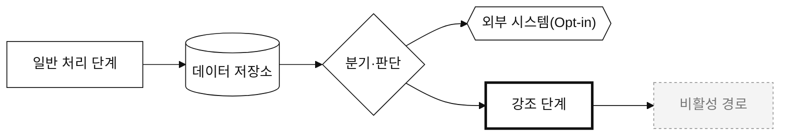
```mermaid
%%{init: {'theme':'base', 'themeVariables': {
  'primaryColor':'#ffffff', 'primaryTextColor':'#111111', 'primaryBorderColor':'#111111',
  'lineColor':'#111111', 'secondaryColor':'#ffffff', 'tertiaryColor':'#ffffff',
  'background':'#ffffff', 'mainBkg':'#ffffff', 'textColor':'#111111',
  'nodeBorder':'#111111', 'clusterBkg':'#ffffff', 'clusterBorder':'#111111',
  'edgeLabelBackground':'#ffffff', 'fontFamily':'Pretendard, Malgun Gothic, sans-serif'
}}}%%
flowchart LR
    a["일반 처리 단계"]
    b[("데이터 저장소")]
    c{"분기·판단"}
    d{{"외부 시스템(Opt-in)"}}
    e["강조 단계"]:::strong
    f["비활성 경로"]:::off
    a --> b --> c --> d
    c --> e --> f
    classDef strong fill:#ffffff,color:#111111,stroke:#111111,stroke-width:3px;
    classDef off fill:#f4f4f4,color:#777777,stroke:#999999,stroke-width:1px,stroke-dasharray: 3 3;
```

---

## 1. 전체 통합 흐름도 (마스터 — Closed-Loop Architecture)

Edge Tier(온디바이스)와 Cloud Tier(온프레미스 서버)가 Wi-Fi 배치 동기화로 맞물리는 전체 구조. 사용자 제안 "Closed-Loop Architecture" 보고서를 [decisions.md #26~#30](../01-plan/decisions/silveryarn-platform.decisions.md)에 따라 온프레미스 스택으로 확정 반영했다.

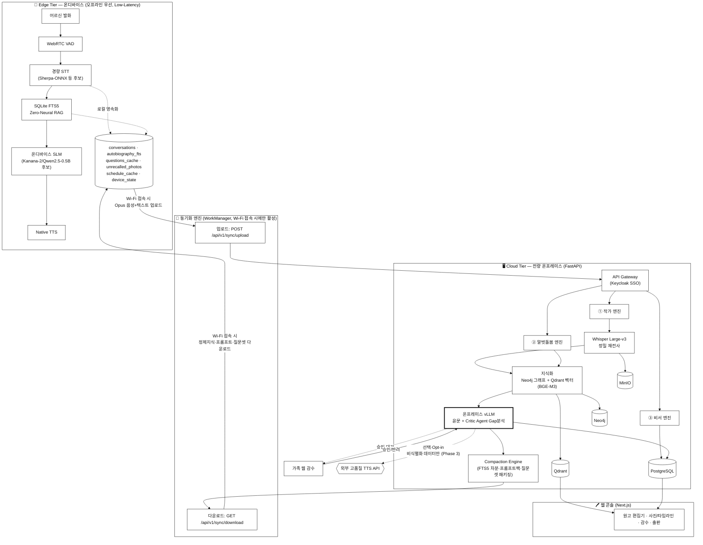
```mermaid
%%{init: {'theme':'base', 'themeVariables': {'primaryColor':'#ffffff','primaryTextColor':'#111111','primaryBorderColor':'#111111','lineColor':'#111111','background':'#ffffff','mainBkg':'#ffffff','textColor':'#111111','clusterBkg':'#ffffff','clusterBorder':'#111111','edgeLabelBackground':'#ffffff'}}}%%
flowchart TB
    subgraph EDGE["📱 Edge Tier — 온디바이스 (오프라인 우선, Low-Latency)"]
        MIC["어르신 발화"] --> VAD["WebRTC VAD"] --> STTD["경량 STT<br/>(Sherpa-ONNX 등 후보)"]
        STTD --> FTS["SQLite FTS5<br/>Zero-Neural RAG"] --> SLM["온디바이스 SLM<br/>(Kanana-2/Qwen2.5-0.5B 후보)"]
        SLM --> TTSD["Native TTS"]
        STTD -.->|"로컬 영속화"| LOCAL[("conversations · autobiography_fts<br/>questions_cache · unrecalled_photos<br/>schedule_cache · device_state")]
        FTS -.-> LOCAL
    end

    LOCAL -->|"Wi-Fi 접속 시<br/>Opus 음성+텍스트 업로드"| SYNCUP
    SYNCDOWN -->|"Wi-Fi 접속 시<br/>정제지식·프롬프트·질문셋 다운로드"| LOCAL

    subgraph SYNC["🔄 동기화 엔진 (WorkManager, Wi-Fi 접속 시에만 활성)"]
        SYNCUP["업로드: POST /api/v1/sync/upload"]
        SYNCDOWN["다운로드: GET /api/v1/sync/download"]
    end

    SYNCUP --> GW

    subgraph SERVER["🖥️ Cloud Tier — 전량 온프레미스 (FastAPI)"]
        GW["API Gateway<br/>(Keycloak SSO)"]
        GW --> E1["① 작가 엔진"]
        GW --> E2["② 말벗돌봄 엔진"]
        GW --> E3["③ 비서 엔진"]
        E1 --> STTP["Whisper Large-v3<br/>정밀 재전사"]
        STTP --> KG["지식화<br/>Neo4j 그래프 + Qdrant 벡터(BGE-M3)"]
        KG --> GEN["온프레미스 vLLM<br/>윤문 + Critic Agent Gap분석"]:::strong
        GEN --> PACK["Compaction Engine<br/>(FTS5 차분·프롬프트팩·질문셋 패키징)"]
        PACK --> SYNCDOWN
        E2 --> KG
        E3 --> RDB
        KG --> VDB[("Qdrant")]
        KG --> GRAPH[("Neo4j")]
        GEN --> RDB[("PostgreSQL")]
        STTP --> OBJ[("MinIO")]
    end

    VDB --> WEB
    RDB --> WEB
    GEN -.->|"승인 대기"| REVIEW["가족 웹 감수"]
    REVIEW -->|"승인/반려"| GEN

    GEN -.->|"선택·Opt-in<br/>비식별화 데이터만 (Phase 3)"| EXT{{"외부 고품질 TTS API"}}

    subgraph CONSOLE["🖊️ 웹 콘솔 (Next.js)"]
        WEB["원고 편집기 · 사진/타임라인 · 감수 · 출판"]
    end

    classDef strong fill:#ffffff,color:#111111,stroke:#111111,stroke-width:3px;
    classDef off fill:#f4f4f4,color:#777777,stroke:#999999,stroke-width:1px,stroke-dasharray: 3 3;
```

> **미채택 사항**: 원 제안의 GPT-4o/Claude(외부 LLM), Milvus(Vector DB)는 각각 온프레미스 vLLM, Qdrant로 대체 확정([decisions.md #26](../01-plan/decisions/silveryarn-platform.decisions.md), [#28](../01-plan/decisions/silveryarn-platform.decisions.md)).

---

## 2. 온디바이스 실시간 대화 파이프라인 (8단계, 저사양 단말 최적화)

말벗돌봄 모드의 응답 지연을 최소화하기 위한 온디바이스 세부 처리 흐름. [decisions.md #31](../01-plan/decisions/silveryarn-platform.decisions.md)의 최적화 기법(800ms VAD, 문장단위 스트리밍)을 반영했다.

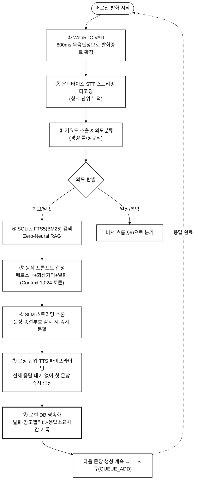
```mermaid
%%{init: {'theme':'base', 'themeVariables': {'primaryColor':'#ffffff','primaryTextColor':'#111111','primaryBorderColor':'#111111','lineColor':'#111111','background':'#ffffff','mainBkg':'#ffffff','textColor':'#111111','edgeLabelBackground':'#ffffff'}}}%%
flowchart TD
    A(["어르신 발화 시작"]) --> B["① WebRTC VAD<br/>800ms 묵음판정으로 발화종료 확정"]
    B --> C["② 온디바이스 STT 스트리밍 디코딩<br/>(청크 단위 누적)"]
    C --> D["③ 키워드 추출 & 의도분류<br/>(경량 룰/정규식)"]
    D --> E{"의도 판별"}
    E -- "회고/말벗" --> F["④ SQLite FTS5(BM25) 검색<br/>Zero-Neural RAG"]
    E -- "일정/복약" --> SCHED["비서 흐름(§9)으로 분기"]
    F --> G["⑤ 동적 프롬프트 합성<br/>페르소나+회상기억+발화 (Context 1,024 토큰)"]
    G --> H["⑥ SLM 스트리밍 추론<br/>문장 종결부호 감지 시 즉시 분할"]
    H --> I["⑦ 문장 단위 TTS 파이프라이닝<br/>전체 응답 대기 없이 첫 문장 즉시 합성"]
    I --> J["⑧ 로컬 DB 영속화<br/>발화·참조챕터ID·응답소요시간 기록"]:::strong
    J --> K["다음 문장 생성 계속 → TTS 큐(QUEUE_ADD)"]
    K -.->|"응답 완료"| A

    classDef strong fill:#ffffff,color:#111111,stroke:#111111,stroke-width:3px;
```

> ⚠️ 구체 라이브러리(Sherpa-ONNX 등)와 지연시간·메모리 수치는 설계 목표치이며 실기기 벤치마크(decisions.md #27) 전까지 미검증.

---

## 3. Wi-Fi 배치 동기화 — 시퀀스 흐름

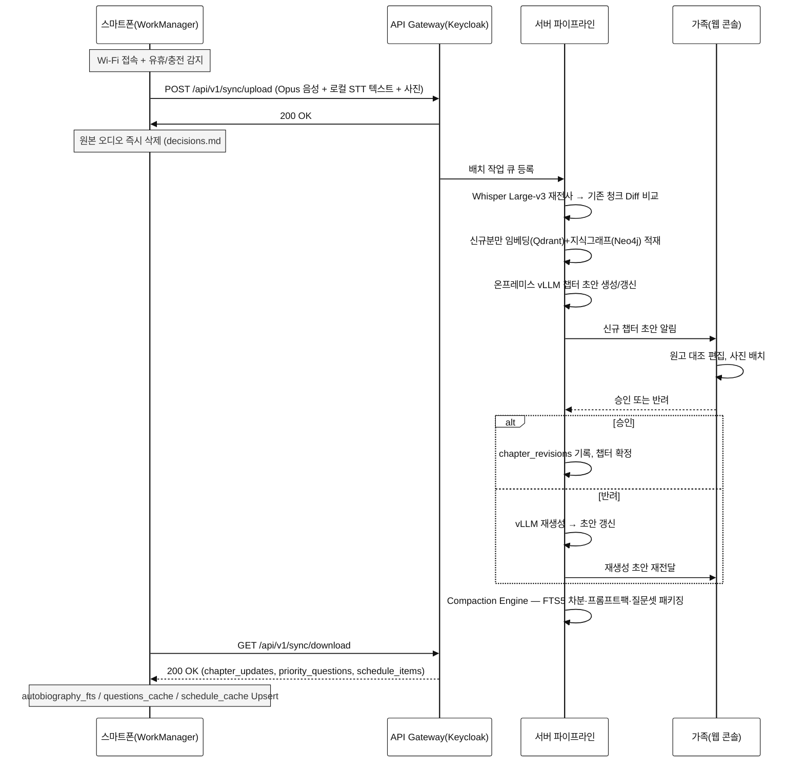
```mermaid
%%{init: {'theme':'base', 'themeVariables': {'primaryColor':'#ffffff','primaryTextColor':'#111111','primaryBorderColor':'#111111','lineColor':'#111111','background':'#ffffff','actorBkg':'#ffffff','actorBorder':'#111111','actorTextColor':'#111111','signalColor':'#111111','signalTextColor':'#111111','labelBoxBkgColor':'#ffffff','labelBoxBorderColor':'#111111','noteBkgColor':'#f4f4f4','noteBorderColor':'#111111','sequenceNumberColor':'#111111'}}}%%
sequenceDiagram
    participant D as 스마트폰(WorkManager)
    participant G as API Gateway(Keycloak)
    participant S as 서버 파이프라인
    participant F as 가족(웹 콘솔)

    Note over D: Wi-Fi 접속 + 유휴/충전 감지
    D->>G: POST /api/v1/sync/upload (Opus 음성 + 로컬 STT 텍스트 + 사진)
    G->>D: 200 OK
    Note over D: 원본 오디오 즉시 삭제 (decisions.md #30)
    G->>S: 배치 작업 큐 등록
    S->>S: Whisper Large-v3 재전사 → 기존 청크 Diff 비교
    S->>S: 신규분만 임베딩(Qdrant)+지식그래프(Neo4j) 적재
    S->>S: 온프레미스 vLLM 챕터 초안 생성/갱신
    S->>F: 신규 챕터 초안 알림
    F->>F: 원고 대조 편집, 사진 배치
    F-->>S: 승인 또는 반려
    alt 승인
        S->>S: chapter_revisions 기록, 챕터 확정
    else 반려
        S->>S: vLLM 재생성 → 초안 갱신
        S->>F: 재생성 초안 재전달
    end
    S->>S: Compaction Engine — FTS5 차분·프롬프트팩·질문셋 패키징
    D->>G: GET /api/v1/sync/download
    G-->>D: 200 OK (chapter_updates, priority_questions, schedule_items)
    Note over D: autobiography_fts / questions_cache / schedule_cache Upsert
```

---

## 4. 자서전 작가 엔진 상세 흐름

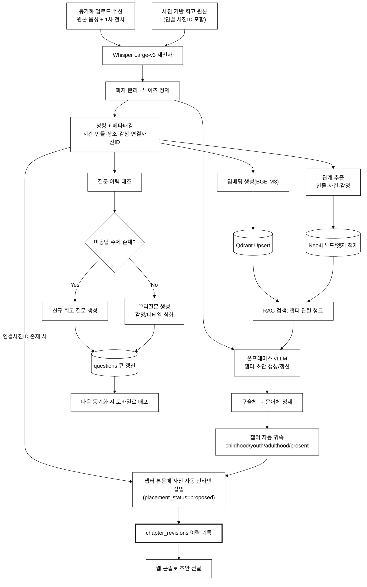
```mermaid
%%{init: {'theme':'base', 'themeVariables': {'primaryColor':'#ffffff','primaryTextColor':'#111111','primaryBorderColor':'#111111','lineColor':'#111111','background':'#ffffff','mainBkg':'#ffffff','textColor':'#111111','edgeLabelBackground':'#ffffff'}}}%%
flowchart TD
    A["동기화 업로드 수신<br/>원본 음성 + 1차 전사"] --> B["Whisper Large-v3 재전사"]
    PH["사진 기반 회고 원본<br/>(연결 사진ID 포함)"] --> B
    B --> C["화자 분리 · 노이즈 정제"]
    C --> D["청킹 + 메타태깅<br/>시간·인물·장소·감정·연결사진ID"]
    D --> E["임베딩 생성(BGE-M3)"] --> VDB[("Qdrant Upsert")]
    D --> KG["관계 추출<br/>인물·사건·감정"] --> GRAPH[("Neo4j 노드/엣지 적재")]
    D --> G["질문 이력 대조"]
    G --> H{"미응답 주제 존재?"}
    H -- "Yes" --> I["신규 회고 질문 생성"]
    H -- "No" --> J["꼬리질문 생성<br/>감정/디테일 심화"]
    I --> QQ[("questions 큐 갱신")]
    J --> QQ
    VDB --> L["RAG 검색: 챕터 관련 청크"]
    GRAPH --> L
    C --> M["온프레미스 vLLM<br/>챕터 초안 생성/갱신"]
    L --> M
    M --> N["구술체 → 문어체 정제"]
    N --> O["챕터 자동 귀속<br/>childhood/youth/adulthood/present"]
    D -- "연결사진ID 존재 시" --> O2["챕터 본문에 사진 자동 인라인 삽입<br/>(placement_status=proposed)"]
    O --> O2
    O2 --> CR["chapter_revisions 이력 기록"]:::strong
    CR --> P["웹 콘솔로 초안 전달"]
    QQ --> Q["다음 동기화 시 모바일로 배포"]

    classDef strong fill:#ffffff,color:#111111,stroke:#111111,stroke-width:3px;
```

---

## 5. RAG 인덱싱 · 검색 파이프라인 (서버 vs 온디바이스 이원화)

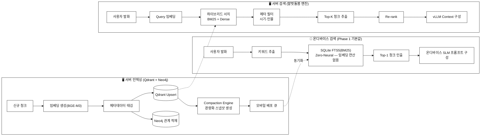
```mermaid
%%{init: {'theme':'base', 'themeVariables': {'primaryColor':'#ffffff','primaryTextColor':'#111111','primaryBorderColor':'#111111','lineColor':'#111111','background':'#ffffff','mainBkg':'#ffffff','textColor':'#111111','clusterBkg':'#ffffff','clusterBorder':'#111111','edgeLabelBackground':'#ffffff'}}}%%
flowchart LR
    subgraph SERVER_IDX["🖥️ 서버 인덱싱 (Qdrant + Neo4j)"]
        I1["신규 청크"] --> I2["임베딩 생성(BGE-M3)"]
        I2 --> I3["메타데이터 태깅"]
        I3 --> I4[("Qdrant Upsert")]
        I3 --> I5[("Neo4j 관계 적재")]
        I4 --> I6["Compaction Engine<br/>경량화 스냅샷 생성"]
        I6 --> I7["모바일 배포 큐"]
    end

    subgraph SERVER_RET["🖥️ 서버 검색 (말벗돌봄 엔진)"]
        R1["사용자 발화"] --> R2["Query 임베딩"]
        R2 --> R3["하이브리드 서치<br/>BM25 + Dense"]
        R3 --> R4["메타 필터<br/>시기·인물"]
        R4 --> R5["Top-K 청크 추출"] --> R6["Re-rank"] --> R7["vLLM Context 구성"]
    end

    subgraph DEVICE_RET["📱 온디바이스 검색 (Phase 1 기본값)"]
        D1["사용자 발화"] --> D2["키워드 추출"]
        D2 --> D3["SQLite FTS5(BM25)<br/>Zero-Neural — 임베딩 연산 없음"]
        D3 --> D4["Top-1 청크 인출"] --> D5["온디바이스 SLM 프롬프트 구성"]
    end

    I4 -.-> R3
    I7 -.->|"동기화"| D3
```

> 경량 VectorDB(임베딩 기반 온디바이스 검색)는 고사양 단말 한정 Phase 2+ 검토 대상([decisions.md #32](../01-plan/decisions/silveryarn-platform.decisions.md)).

---

## 6. 사진 기반 회고 → 챕터 인라인 편입

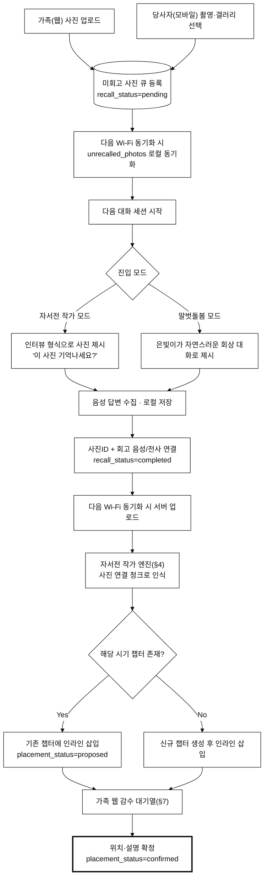
```mermaid
%%{init: {'theme':'base', 'themeVariables': {'primaryColor':'#ffffff','primaryTextColor':'#111111','primaryBorderColor':'#111111','lineColor':'#111111','background':'#ffffff','mainBkg':'#ffffff','textColor':'#111111','edgeLabelBackground':'#ffffff'}}}%%
flowchart TD
    U1["가족(웹) 사진 업로드"] --> Q[("미회고 사진 큐 등록<br/>recall_status=pending")]
    U2["당사자(모바일) 촬영·갤러리 선택"] --> Q
    Q --> Sync["다음 Wi-Fi 동기화 시<br/>unrecalled_photos 로컬 동기화"]
    Sync --> Session["다음 대화 세션 시작"]
    Session --> Mode{"진입 모드"}
    Mode -- "자서전 작가 모드" --> Author["인터뷰 형식으로 사진 제시<br/>'이 사진 기억나세요?'"]
    Mode -- "말벗돌봄 모드" --> Care["은빛이가 자연스러운 회상 대화로 제시"]
    Author --> Answer["음성 답변 수집 · 로컬 저장"]
    Care --> Answer
    Answer --> Link["사진ID + 회고 음성/전사 연결<br/>recall_status=completed"]
    Link --> Upload["다음 Wi-Fi 동기화 시 서버 업로드"]
    Upload --> Engine["자서전 작가 엔진(§4)<br/>사진 연결 청크로 인식"]
    Engine --> Exist{"해당 시기 챕터 존재?"}
    Exist -- "Yes" --> Update["기존 챕터에 인라인 삽입<br/>placement_status=proposed"]
    Exist -- "No" --> New["신규 챕터 생성 후 인라인 삽입"]
    Update --> Review["가족 웹 감수 대기열(§7)"]
    New --> Review
    Review --> Confirm["위치·설명 확정<br/>placement_status=confirmed"]:::strong

    classDef strong fill:#ffffff,color:#111111,stroke:#111111,stroke-width:3px;
```

---

## 7. 가족 협업 · 감수 워크플로우

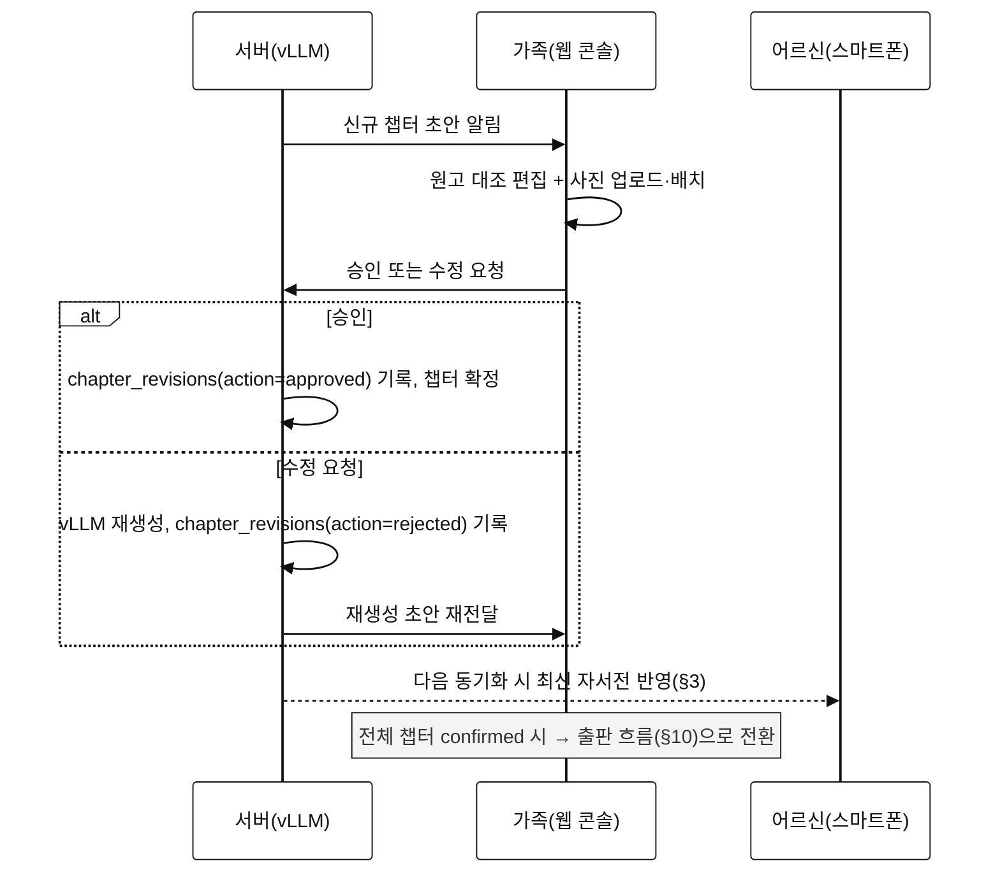
```mermaid
%%{init: {'theme':'base', 'themeVariables': {'primaryColor':'#ffffff','primaryTextColor':'#111111','primaryBorderColor':'#111111','lineColor':'#111111','background':'#ffffff','actorBkg':'#ffffff','actorBorder':'#111111','actorTextColor':'#111111','signalColor':'#111111','signalTextColor':'#111111','labelBoxBkgColor':'#ffffff','labelBoxBorderColor':'#111111','noteBkgColor':'#f4f4f4','noteBorderColor':'#111111'}}}%%
sequenceDiagram
    participant AI as 서버(vLLM)
    participant F as 가족(웹 콘솔)
    participant P as 어르신(스마트폰)

    AI->>F: 신규 챕터 초안 알림
    F->>F: 원고 대조 편집 + 사진 업로드·배치
    F->>AI: 승인 또는 수정 요청
    alt 승인
        AI->>AI: chapter_revisions(action=approved) 기록, 챕터 확정
    else 수정 요청
        AI->>AI: vLLM 재생성, chapter_revisions(action=rejected) 기록
        AI->>F: 재생성 초안 재전달
    end
    AI-->>P: 다음 동기화 시 최신 자서전 반영(§3)
    Note over F: 전체 챕터 confirmed 시 → 출판 흐름(§10)으로 전환
```

---

## 8. 정서 모니터링 처리 흐름 (Phase 1 비활성)

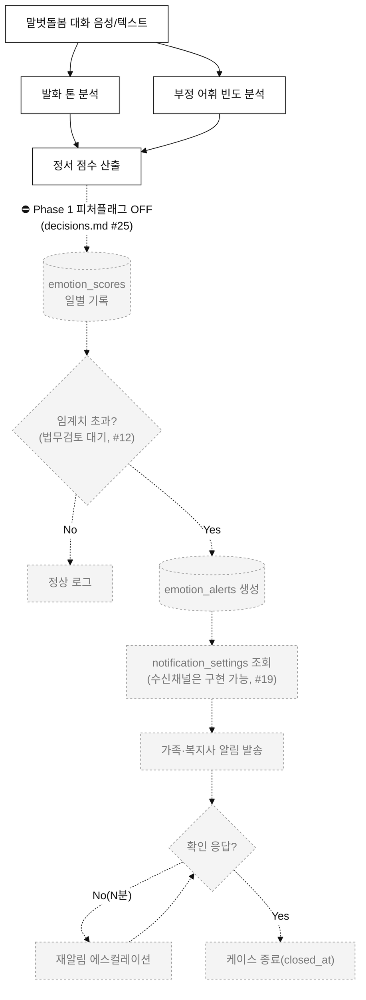
```mermaid
%%{init: {'theme':'base', 'themeVariables': {'primaryColor':'#ffffff','primaryTextColor':'#111111','primaryBorderColor':'#111111','lineColor':'#111111','background':'#ffffff','mainBkg':'#ffffff','textColor':'#111111','edgeLabelBackground':'#ffffff'}}}%%
flowchart TD
    V["말벗돌봄 대화 음성/텍스트"] --> T["발화 톤 분석"]
    V --> W["부정 어휘 빈도 분석"]
    T --> SC["정서 점수 산출"]
    W --> SC
    SC -.->|"⛔ Phase 1 피처플래그 OFF<br/>(decisions.md #25)"| ES[("emotion_scores<br/>일별 기록")]:::off
    ES -.-> TH{"임계치 초과?<br/>(법무검토 대기, #12)"}:::off
    TH -. "No" .-> LOG["정상 로그"]:::off
    TH -. "Yes" .-> EA[("emotion_alerts 생성")]:::off
    EA -.-> NS["notification_settings 조회<br/>(수신채널은 구현 가능, #19)"]:::off
    NS -.-> ESC["가족·복지사 알림 발송"]:::off
    ESC -.-> ACK{"확인 응답?"}:::off
    ACK -. "No(N분)" .-> RE["재알림 에스컬레이션"]:::off
    RE -.-> ACK
    ACK -. "Yes" .-> CLOSE["케이스 종료(closed_at)"]:::off

    classDef off fill:#f4f4f4,color:#777777,stroke:#999999,stroke-width:1px,stroke-dasharray: 3 3;
```

> 회색 점선 = 현재 비활성 경로. "언제 보낼지"(임계치)는 법무·윤리 검토 완료 후 활성화, "누가·어디로 받을지"(NS)만 구조 구현 가능([decisions.md #12](../01-plan/decisions/silveryarn-platform.decisions.md), [#19](../01-plan/decisions/silveryarn-platform.decisions.md), [#25](../01-plan/decisions/silveryarn-platform.decisions.md)).

---

## 9. 비서 모드 — 일정 · 복약 로컬 흐름

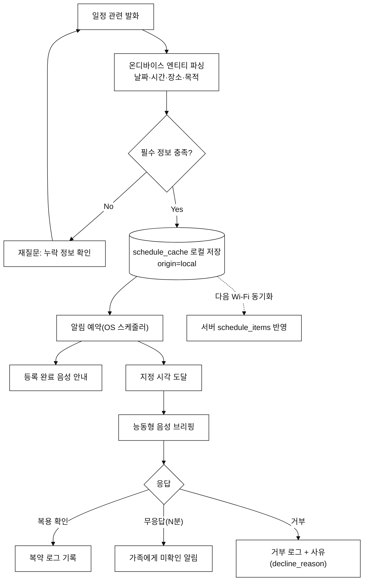
```mermaid
%%{init: {'theme':'base', 'themeVariables': {'primaryColor':'#ffffff','primaryTextColor':'#111111','primaryBorderColor':'#111111','lineColor':'#111111','background':'#ffffff','mainBkg':'#ffffff','textColor':'#111111','edgeLabelBackground':'#ffffff'}}}%%
flowchart TD
    Speech["일정 관련 발화"] --> Parse["온디바이스 엔티티 파싱<br/>날짜·시간·장소·목적"]
    Parse --> Valid{"필수 정보 충족?"}
    Valid -- "No" --> Clarify["재질문: 누락 정보 확인"]
    Clarify --> Speech
    Valid -- "Yes" --> Save[("schedule_cache 로컬 저장<br/>origin=local")]
    Save --> Schedule["알림 예약(OS 스케줄러)"]
    Schedule --> Confirm["등록 완료 음성 안내"]
    Schedule --> Trigger["지정 시각 도달"]
    Trigger --> Push["능동형 음성 브리핑"]
    Push --> Resp{"응답"}
    Resp -- "복용 확인" --> LogOk["복약 로그 기록"]
    Resp -- "무응답(N분)" --> EscF["가족에게 미확인 알림"]
    Resp -- "거부" --> LogSkip["거부 로그 + 사유(decline_reason)"]
    Save -.->|"다음 Wi-Fi 동기화"| ServerSync["서버 schedule_items 반영"]
```

---

## 10. 출판/인쇄 파이프라인

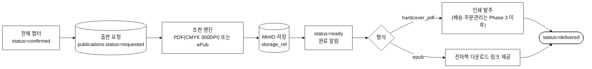
```mermaid
%%{init: {'theme':'base', 'themeVariables': {'primaryColor':'#ffffff','primaryTextColor':'#111111','primaryBorderColor':'#111111','lineColor':'#111111','background':'#ffffff','mainBkg':'#ffffff','textColor':'#111111','edgeLabelBackground':'#ffffff'}}}%%
flowchart LR
    A["전체 챕터<br/>status=confirmed"] --> B[("출판 요청<br/>publications.status=requested")]
    B --> C["조판 엔진<br/>PDF(CMYK 300DPI) 또는 ePub"]
    C --> D[("MinIO 저장<br/>storage_ref")]
    D --> E["status=ready<br/>완료 알림"]
    E --> F{"형식"}
    F -- "hardcover_pdf" --> G["인쇄 발주<br/>(배송·주문관리는 Phase 3 이후)"]
    F -- "epub" --> H["전자책 다운로드 링크 제공"]
    G --> I(["status=delivered"])
    H --> I
```

---

## 11. 설치모드 자동 분기 흐름

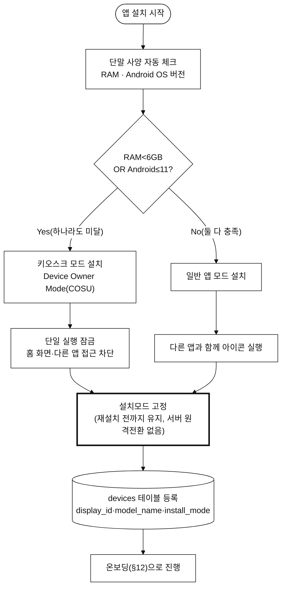
```mermaid
%%{init: {'theme':'base', 'themeVariables': {'primaryColor':'#ffffff','primaryTextColor':'#111111','primaryBorderColor':'#111111','lineColor':'#111111','background':'#ffffff','mainBkg':'#ffffff','textColor':'#111111','edgeLabelBackground':'#ffffff'}}}%%
flowchart TD
    Start(["앱 설치 시작"]) --> Check["단말 사양 자동 체크<br/>RAM · Android OS 버전"]
    Check --> Judge{"RAM&lt;6GB<br/>OR Android≤11?"}
    Judge -- "Yes(하나라도 미달)" --> Kiosk["키오스크 모드 설치<br/>Device Owner Mode(COSU)"]
    Judge -- "No(둘 다 충족)" --> Normal["일반 앱 모드 설치"]
    Kiosk --> KioskLock["단일 실행 잠금<br/>홈 화면·다른 앱 접근 차단"]
    Normal --> NormalIcon["다른 앱과 함께 아이콘 실행"]
    KioskLock --> Fixed["설치모드 고정<br/>(재설치 전까지 유지, 서버 원격전환 없음)"]:::strong
    NormalIcon --> Fixed
    Fixed --> Register[("devices 테이블 등록<br/>display_id·model_name·install_mode")]
    Register --> Onboard["온보딩(§12)으로 진행"]

    classDef strong fill:#ffffff,color:#111111,stroke:#111111,stroke-width:3px;
```

---

## 12. 온보딩 · 가족 페어링 흐름

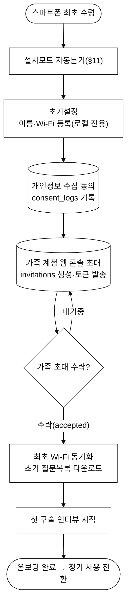
```mermaid
%%{init: {'theme':'base', 'themeVariables': {'primaryColor':'#ffffff','primaryTextColor':'#111111','primaryBorderColor':'#111111','lineColor':'#111111','background':'#ffffff','mainBkg':'#ffffff','textColor':'#111111','edgeLabelBackground':'#ffffff'}}}%%
flowchart TD
    A(["스마트폰 최초 수령"]) --> B["설치모드 자동분기(§11)"]
    B --> C["초기설정<br/>이름·Wi-Fi 등록(로컬 전용)"]
    C --> D[("개인정보 수집 동의<br/>consent_logs 기록")]
    D --> E[("가족 계정 웹 콘솔 초대<br/>invitations 생성·토큰 발송")]
    E --> F{"가족 초대 수락?"}
    F -- "대기중" --> E
    F -- "수락(accepted)" --> G["최초 Wi-Fi 동기화<br/>초기 질문목록 다운로드"]
    G --> H["첫 구술 인터뷰 시작"]
    H --> I(["온보딩 완료 → 정기 사용 전환"])
```

---

## 13. Wi-Fi 동기화 상태 전이

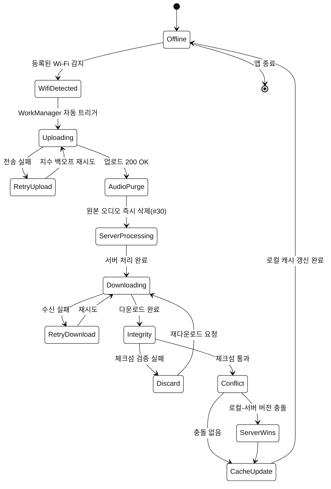
```mermaid
%%{init: {'theme':'base', 'themeVariables': {'primaryColor':'#ffffff','primaryTextColor':'#111111','primaryBorderColor':'#111111','lineColor':'#111111','background':'#ffffff','mainBkg':'#ffffff','textColor':'#111111'}}}%%
stateDiagram-v2
    [*] --> Offline
    Offline --> WifiDetected: 등록된 Wi-Fi 감지
    WifiDetected --> Uploading: WorkManager 자동 트리거
    Uploading --> RetryUpload: 전송 실패
    RetryUpload --> Uploading: 지수 백오프 재시도
    Uploading --> AudioPurge: 업로드 200 OK
    AudioPurge --> ServerProcessing: 원본 오디오 즉시 삭제(#30)
    ServerProcessing --> Downloading: 서버 처리 완료
    Downloading --> RetryDownload: 수신 실패
    RetryDownload --> Downloading: 재시도
    Downloading --> Integrity: 다운로드 완료
    Integrity --> Discard: 체크섬 검증 실패
    Discard --> Downloading: 재다운로드 요청
    Integrity --> Conflict: 체크섬 통과
    Conflict --> ServerWins: 로컬-서버 버전 충돌
    Conflict --> CacheUpdate: 충돌 없음
    ServerWins --> CacheUpdate
    CacheUpdate --> Offline: 로컬 캐시 갱신 완료
    Offline --> [*]: 앱 종료
```

---

## 14. 자서전 제작 전체 라이프사이클 (매크로)

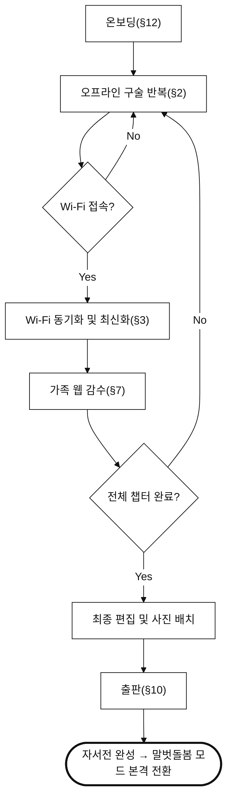
```mermaid
%%{init: {'theme':'base', 'themeVariables': {'primaryColor':'#ffffff','primaryTextColor':'#111111','primaryBorderColor':'#111111','lineColor':'#111111','background':'#ffffff','mainBkg':'#ffffff','textColor':'#111111','edgeLabelBackground':'#ffffff'}}}%%
flowchart TD
    A["온보딩(§12)"] --> B["오프라인 구술 반복(§2)"]
    B --> C{"Wi-Fi 접속?"}
    C -- "No" --> B
    C -- "Yes" --> D["Wi-Fi 동기화 및 최신화(§3)"]
    D --> E["가족 웹 감수(§7)"]
    E --> F{"전체 챕터 완료?"}
    F -- "No" --> B
    F -- "Yes" --> G["최종 편집 및 사진 배치"]
    G --> H["출판(§10)"]
    H --> I(["자서전 완성 → 말벗돌봄 모드 본격 전환"]):::strong

    classDef strong fill:#ffffff,color:#111111,stroke:#111111,stroke-width:3px;
```

---

## 15. 관리자 업무 프로세스 (기기관리 · 모니터링)

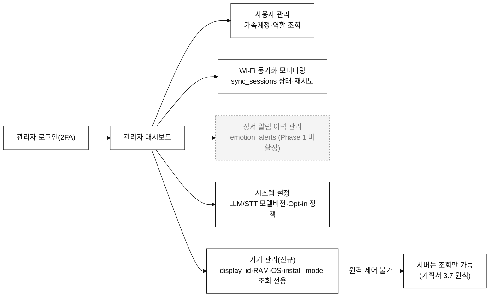
```mermaid
%%{init: {'theme':'base', 'themeVariables': {'primaryColor':'#ffffff','primaryTextColor':'#111111','primaryBorderColor':'#111111','lineColor':'#111111','background':'#ffffff','mainBkg':'#ffffff','textColor':'#111111','edgeLabelBackground':'#ffffff'}}}%%
flowchart LR
    Admin["관리자 로그인(2FA)"] --> Dash["관리자 대시보드"]
    Dash --> U["사용자 관리<br/>가족계정·역할 조회"]
    Dash --> S["Wi-Fi 동기화 모니터링<br/>sync_sessions 상태·재시도"]
    Dash --> E["정서 알림 이력 관리<br/>emotion_alerts (Phase 1 비활성)"]:::off
    Dash --> Sys["시스템 설정<br/>LLM/STT 모델버전·Opt-in 정책"]
    Dash --> Dev["기기 관리(신규)<br/>display_id·RAM·OS·install_mode 조회 전용"]
    Dev -.->|"원격 제어 불가"| NoRemote["서버는 조회만 가능<br/>(기획서 3.7 원칙)"]

    classDef off fill:#f4f4f4,color:#777777,stroke:#999999,stroke-width:1px,stroke-dasharray: 3 3;
```

---

## 16. 조직/역할별 스윔레인 — 전체 업무 흐름 개관

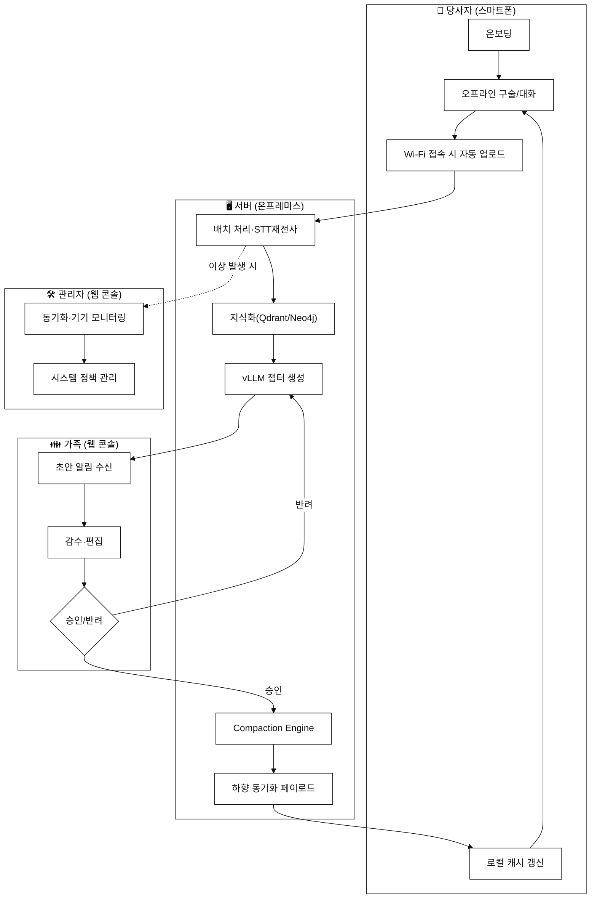
```mermaid
%%{init: {'theme':'base', 'themeVariables': {'primaryColor':'#ffffff','primaryTextColor':'#111111','primaryBorderColor':'#111111','lineColor':'#111111','background':'#ffffff','mainBkg':'#ffffff','textColor':'#111111','clusterBkg':'#ffffff','clusterBorder':'#111111','edgeLabelBackground':'#ffffff'}}}%%
flowchart TB
    subgraph L1["👤 당사자 (스마트폰)"]
        p1["온보딩"] --> p2["오프라인 구술/대화"] --> p3["Wi-Fi 접속 시 자동 업로드"]
        p6["로컬 캐시 갱신"] --> p2
    end
    subgraph L2["🖥️ 서버 (온프레미스)"]
        s1["배치 처리·STT재전사"] --> s2["지식화(Qdrant/Neo4j)"] --> s3["vLLM 챕터 생성"]
        s4["Compaction Engine"] --> s5["하향 동기화 페이로드"]
    end
    subgraph L3["👪 가족 (웹 콘솔)"]
        f1["초안 알림 수신"] --> f2["감수·편집"] --> f3{"승인/반려"}
    end
    subgraph L4["🛠️ 관리자 (웹 콘솔)"]
        a1["동기화·기기 모니터링"] --> a2["시스템 정책 관리"]
    end

    p3 --> s1
    s3 --> f1
    f3 -->|"승인"| s4
    f3 -->|"반려"| s3
    s5 --> p6
    s1 -.->|"이상 발생 시"| a1
```

---

## 17. Wi-Fi 동기화 실패 · 충돌 해결 (상세 로직)

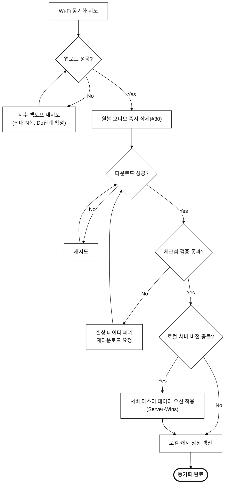
```mermaid
%%{init: {'theme':'base', 'themeVariables': {'primaryColor':'#ffffff','primaryTextColor':'#111111','primaryBorderColor':'#111111','lineColor':'#111111','background':'#ffffff','mainBkg':'#ffffff','textColor':'#111111','edgeLabelBackground':'#ffffff'}}}%%
flowchart TD
    Sync["Wi-Fi 동기화 시도"] --> UploadCheck{"업로드 성공?"}
    UploadCheck -- "No" --> Retry1["지수 백오프 재시도<br/>(최대 N회, Do단계 확정)"]
    Retry1 --> UploadCheck
    UploadCheck -- "Yes" --> Purge["원본 오디오 즉시 삭제(#30)"]
    Purge --> DownloadCheck{"다운로드 성공?"}
    DownloadCheck -- "No" --> Retry2["재시도"]
    Retry2 --> DownloadCheck
    DownloadCheck -- "Yes" --> Integrity{"체크섬 검증 통과?"}
    Integrity -- "No" --> Discard["손상 데이터 폐기<br/>재다운로드 요청"]
    Discard --> DownloadCheck
    Integrity -- "Yes" --> Conflict{"로컬-서버 버전 충돌?"}
    Conflict -- "Yes" --> ServerWins["서버 마스터 데이터 우선 적용<br/>(Server-Wins)"]
    Conflict -- "No" --> Apply["로컬 캐시 정상 갱신"]
    ServerWins --> Apply
    Apply --> Done(["동기화 완료"]):::strong

    classDef strong fill:#ffffff,color:#111111,stroke:#111111,stroke-width:3px;
```

---

## 18. 데이터 계층 흐름 — 서버 스키마 ↔ 온디바이스 스키마 매핑

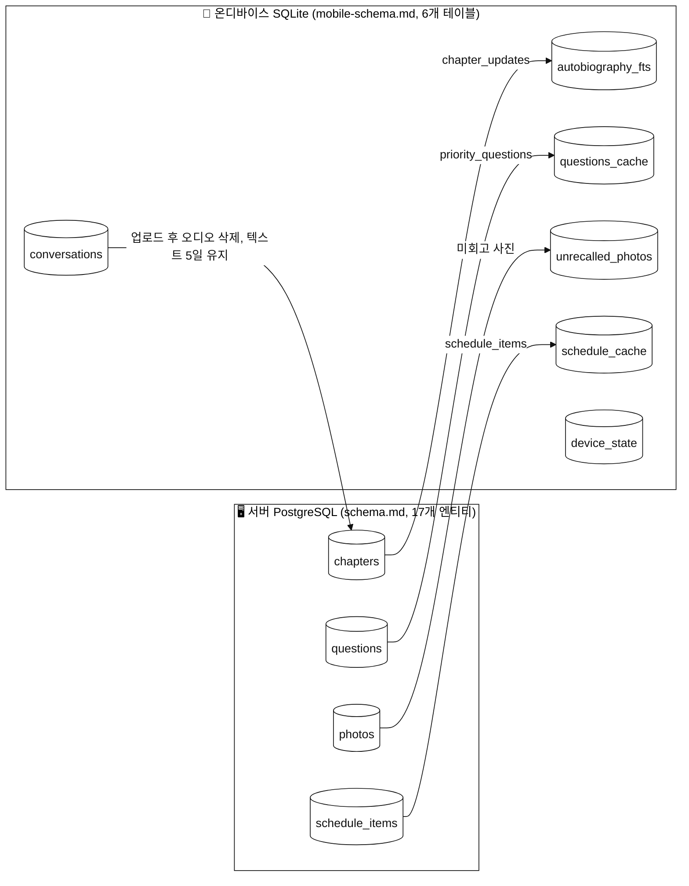
```mermaid
%%{init: {'theme':'base', 'themeVariables': {'primaryColor':'#ffffff','primaryTextColor':'#111111','primaryBorderColor':'#111111','lineColor':'#111111','background':'#ffffff','mainBkg':'#ffffff','textColor':'#111111','clusterBkg':'#ffffff','clusterBorder':'#111111','edgeLabelBackground':'#ffffff'}}}%%
flowchart LR
    subgraph SRV["🖥️ 서버 PostgreSQL (schema.md, 17개 엔티티)"]
        sc[("chapters")]; sp[("photos")]; sq[("questions")]; ss[("schedule_items")]
    end
    subgraph MOB["📱 온디바이스 SQLite (mobile-schema.md, 6개 테이블)"]
        mc[("autobiography_fts")]; mq[("questions_cache")]; mp[("unrecalled_photos")]; ms[("schedule_cache")]; mv[("conversations")]; md[("device_state")]
    end
    sc -->|"chapter_updates"| mc
    sq -->|"priority_questions"| mq
    sp -->|"미회고 사진"| mp
    ss -->|"schedule_items"| ms
    mv -->|"업로드 후 오디오 삭제, 텍스트 5일 유지"| sc
```

---

## 19. 에이전트 라우팅 — 3대 모드 의도 분류

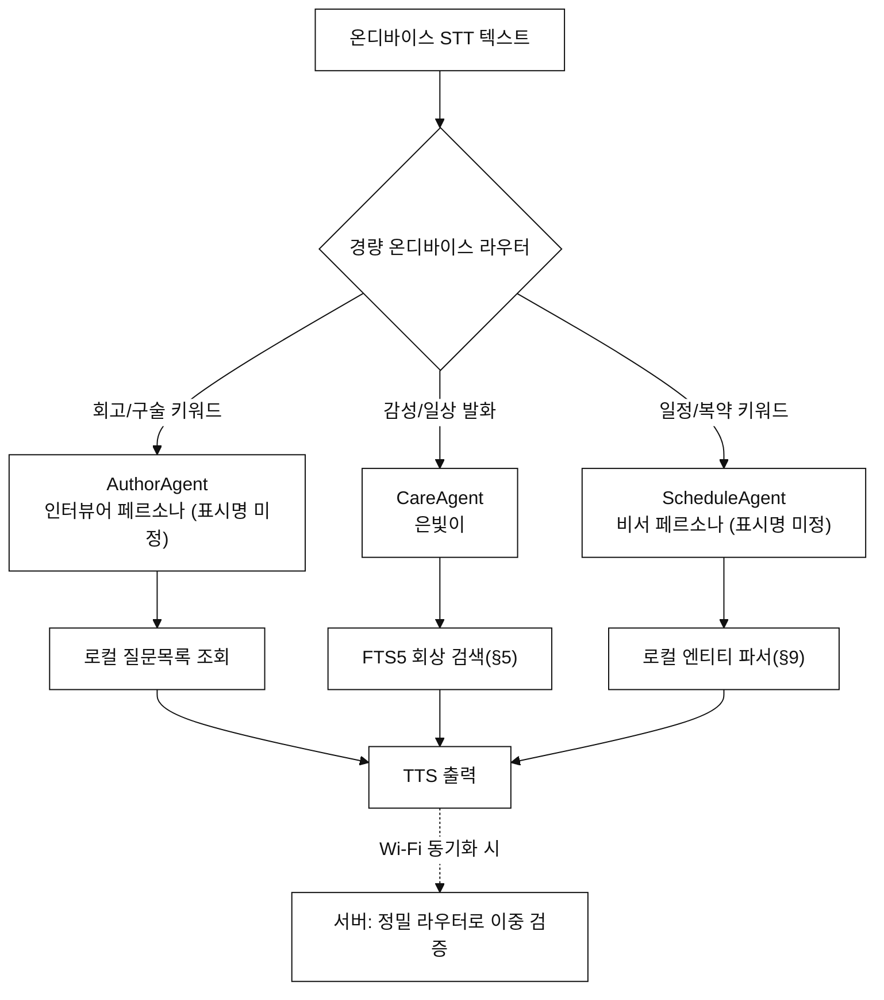
```mermaid
%%{init: {'theme':'base', 'themeVariables': {'primaryColor':'#ffffff','primaryTextColor':'#111111','primaryBorderColor':'#111111','lineColor':'#111111','background':'#ffffff','mainBkg':'#ffffff','textColor':'#111111','edgeLabelBackground':'#ffffff'}}}%%
flowchart TD
    Input["온디바이스 STT 텍스트"] --> Router{"경량 온디바이스 라우터"}
    Router -- "회고/구술 키워드" --> Author["AuthorAgent<br/>인터뷰어 페르소나 (표시명 미정)"]
    Router -- "감성/일상 발화" --> Care["CareAgent<br/>은빛이"]
    Router -- "일정/복약 키워드" --> Sched["ScheduleAgent<br/>비서 페르소나 (표시명 미정)"]
    Author --> A1["로컬 질문목록 조회"] --> AT["TTS 출력"]
    Care --> A2["FTS5 회상 검색(§5)"] --> AT
    Sched --> A3["로컬 엔티티 파서(§9)"] --> AT
    AT -.->|"Wi-Fi 동기화 시"| Server["서버: 정밀 라우터로 이중 검증"]
```

---

## 20. 미결 의사결정이 프로세스에 미치는 영향 (한눈에 보기)

```mermaid
%%{init: {'theme':'base', 'themeVariables': {'primaryColor':'#ffffff','primaryTextColor':'#111111','primaryBorderColor':'#111111','lineColor':'#111111','background':'#ffffff','mainBkg':'#ffffff','textColor':'#111111','edgeLabelBackground':'#ffffff'}}}%%
flowchart LR
    D1["#12 정서모니터링<br/>법적기준"]:::off -.->|"임계치 로직 차단"| P8["§8 정서모니터링<br/>알림발송 단계"]:::off
    D2["#14 예산·인력"]:::off -.->|"착수 자체 차단"| ALL["전체 Do 단계"]:::off
    D3["#27 SLM 모델선정"]:::off -.->|"부분 차단"| P2["§2 실시간대화<br/>SLM 추론 단계"]:::off
    D4["#9 최근5일 캐시"]:::off -.->|"기본값 유지, 재조정 가능"| P18["§18 로컬 스키마<br/>conversations 보존정책"]:::off

    classDef off fill:#f4f4f4,color:#777777,stroke:#999999,stroke-width:1px,stroke-dasharray: 3 3;
```

---

## Related Documents

- Design: [silveryarn-platform.design.md](./features/silveryarn-platform.design.md) (§2.1~§2.12)
- Schema: [schema.md](../01-plan/schema.md), [mobile-schema.md](../01-plan/mobile-schema.md)
- Decisions: [silveryarn-platform.decisions.md](../01-plan/decisions/silveryarn-platform.decisions.md)
- 원본(기획 의도): [`Plan/자서전_말벗돌봄_프로세스_흐름도.md`](../../Plan/자서전_말벗돌봄_프로세스_흐름도.md)
- 발표자료: [은빛실타래_설계발표_슬라이드.html](../presentations/은빛실타래_설계발표_슬라이드.html)

---

## Version History

| Version | Date | Changes | Author |
|---------|------|---------|--------|
| 0.1 | 2026-09-06 | Closed-Loop/실시간파이프라인/Neo4j/FTS5 반영한 현재판 워크플로우 20종 신규 작성 | NUBiz AX Initiative |
| 0.2 | 2026-09-06 | 색상(남색/보라/청록/골드) 기반 구분을 전면 폐지하고 흑백 고대비 스타일로 재작성 — 모든 다이어그램에 흑백 강제 테마 지시자 추가, 역할 구분은 노드 도형·subgraph 레이블·선 스타일로 대체 | NUBiz AX Initiative (사용자 피드백 반영) |
